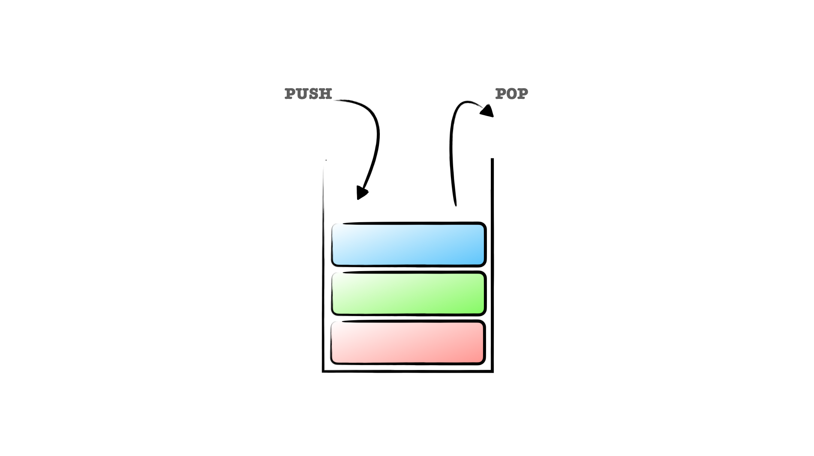

# Stack

스택(Stack)은 LIFO(Last In First Out) 입출력 구조를 가진 선형 자료 구조로서
가장 늦게 PUSH된 요소가 가장 빠르게 POP되는 구조이다.



스택은 자바스크립트의 배열로서 쉽게 표현가능하지만, 몇가지 유틸성 메서드를 가지고 있는
클래스로 구현해볼 수 있다.

```js
const stack = [];

stack.push(1);
stack.push(2);
stack.push(3);

console.log(stack); // [1, 2, 3]

stack.pop(); // 3

cconsole.log(stack); // [1, 2]

const stackTop = stack[stack.length - 1]; 
console.log(stackTop); // 2
```

```ts
class Stack {
  constructor(private data: any[]) {
    this.data = data;
  }
  
  public push(newElement) {
    this.data.push(newElement);
  }
  
  public pop() {
    return this.data.pop();
  }
  
  public top() {
    return this.data[this.data.length - 1] ?? -1;
  }
}

const stack = new Stack();

stack.push(1);
stack.push(2);
stack.push(3);

stack.pop(); // 3
stack.top(); // 2
```
