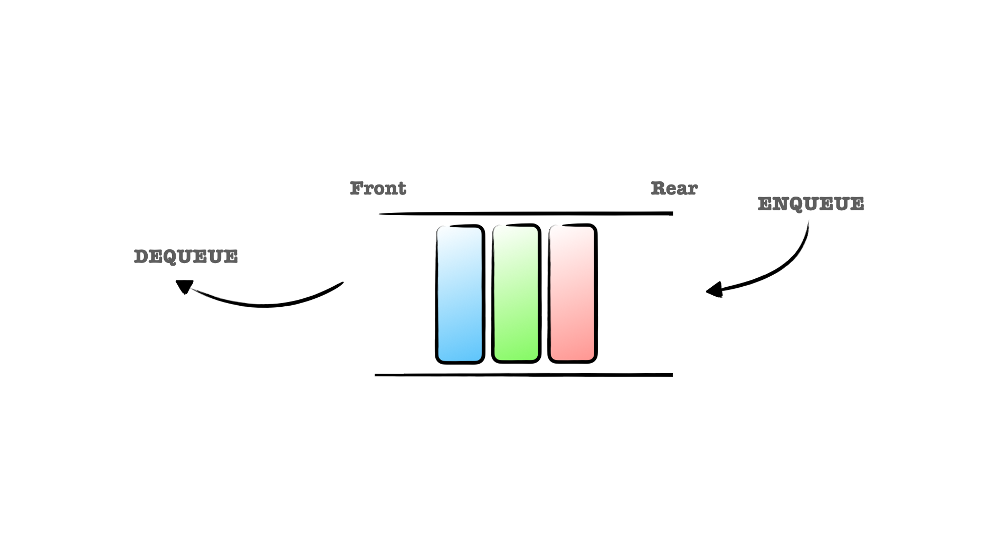

# Queue

큐(Queue)는 FIFO(First In First Out) 입출력 구조를 가진 선형 자료구조이다. 큐의 Rear에서 Enqueue,
Front에서 Dequeue되는 구조이다.



## 선형큐 (Linear Queue)

선형큐는 두 가지 구조로 구현가능하다. 먼저, 배열로 표현이 가능하다. 한정된 배열 사이즈에 Enqueue, Dequeue를
반복적으로 실행하면 배열이 가득차 더이상 추가할 수 없는 문제가 발생한다. 다만, 자바스크립트에서는 동적으로 배열 사이즈가
할당되기 때문에 한정된 사이즈에 대한 이슈에서는 자유롭지만, Front, Rear의 인덱스가 무한정 커질 수 있다는 양날의 검이다.

Front, Rear의 인덱스가 무한정 커지는 이슈를 방지하기 위해 Dequeue가 발생하면 배열 안의 요소들을 앞당기는 작업이 필요한데,
이때 선형 시간이 소요되는 단점이 있다.

배열을 통한 선형 큐 구현의 단점을 보완한 구조가 연결 리스트(Linked List)로 구현된 선형큐이다. 연결 리스트로 선형큐를 구현하면
인덱스에 대한 고민을 하지 않아도 된다. (아래 이미지에서는 Head = Front, Tail = Rear)


### 배열로 구현한 큐

```js
class Queue {
  constructor() {
    this.queue = [];
    this.front = 0;
    this.rear = 0;
  }
  
  public enqueue(newElement) {
    this.queue[this.rear++] = newElement;
  }
  
  public dequeue() {
    const value = this.queue[this.front];
    delete this.queue[this.front++];
    return value;
  }
  
  public peak() {
    return this.queue[this.front];
  }
  
  public size() {
    return this.rear - this.front;
  }
}
```

### 연결 리스트로 구현한 큐

```js
class Node {
  constructor(value) {
    this.value = value;
    this.next = null;
  }
}

class Queue {
  constructor() {
    this.head = null;
    this.tail = null;
    this.size = 0;
  }
  
  public enqueue(newElement) {
    const newNode = new Node(newElement);
    
    if (this.head === null) {
      this.head = this.tail = newNode;
    } else {
      this.tail.next = newNode;
      this.tail = newNode;
    }
    this.size++;
  }
  
  public dequeue() {
    const value = this.head.value;
    this.head = this.head.next;
    this.size--;
    return value;
  }
  
  public peak() {
    return this.head.value;
  }
}
```

## 환영큐 (Circular Queue)

환영큐는 Front, Rear가 이어져 있는 구조의 큐이다. 환영큐는 한정된 사이즈의 공간을 효율적으로 사용하기 위한
구조로 연결 리스트로 구현해도 문제 없지만, 큰 효과를 바라기는 어렵다. 

```js
class CircularQueue {
  constructor(maxSize) {
    this.maxSize = maxSize;
    this.head = null;
    this.rear = null;
    this.size = 0;
  }
  
  public enqueue(newElement) {
    if (isFull()) {
      console.log('Queue is Full!')
      return;
    }
    
    this.queue[this.rear++] = new Node(newElement);
    this.rear = this.rear % this.size;
    this.size++;
  }
  
  public dequeue() {
    const value = this.queue[this.front];
    delete this.queue[this.front++];
    this.front =  this.front % this.maxSize;
    this.size--;
    return value;
  }
  
  public peak() {
    return this.queue[this.front];
  }
  
  public isFull() {
    return this.size === this.maxSize;
  }
}
```


