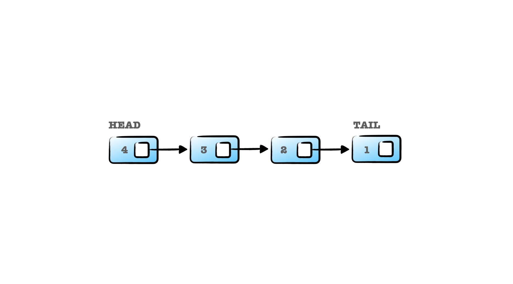

# Linked List

배열의 추가, 삭제 과정에서 선형 시간이 소요되는 단점을 보완하기 위한 자료구조이다.

연결 리스트는 각 요소를 포인터로 연결하여 관리하는 선형 자료구조로서, 각 요소는 노드라 부른다.
각각의 노드는 데이터 영역과 다음 노드를 가리키는 포인터 영역으로 구성되어 있다.



### 탐색, 추가, 삭제의 시간 복잡도

연결리스트는 메모리가 허용하는 한 요소를 제한없이 추가할 수 있다. 배열의 경우 탐색 시간 복잡도는
요소의 인덱스를 알고 있다는 가정하에 O(1)의 시간복잡도를 갖지만, 연결 리스트의 경우 탐색에서
O(n)의 시간 복잡도를 가진다.

하지만, 추가, 삭제의 경우 O(n) 시간 복잡도를 가지는 배열과 달리, 연결 리스트는 O(1)의 시간복잡도를
가진다. 결론적으로 배열보다 추가, 삭제에 용이한 자료구조이다.

### 메모리 영역

연결 리스트는 연속적인 메모리 영역을 갖는 배열과 달리 분산된 메모리 영역을 가진다.

### 연결 리스트의 종류

연결 리스트는 단순 연결 리스트, 이중 연결 리스트, 순환 연결 리스트 등 다양한 구조로 구현된다.
([레퍼런스](https://namu.wiki/w/%EC%97%B0%EA%B2%B0%20%EB%A6%AC%EC%8A%A4%ED%8A%B8#s-3))

### 연결 리스트 구현

```js
class Node {
  constructor(newValue) {
    this.value = newValue;
    this.next = null;
  }
}

class SinglyLinkedList {
  constructor() {
    this.head = null; 
    this.tail = null;
  }
  
  find(value) {
    let currentNode = this.head;
    
    while (currentNode.value !== value) {
      currentNode = currentNode.next;
    }
    
    return currentNode;
  }
  
  append(newValue) {
    const newNode = new Node(newvalue);
    
    if (this.head === null) {
      this.head = this.tail = newNode;
    } else {
      this.tail.next = newNode;
      this.tail = newNode;
    }
  }
  
  insert(node, newValue) {
    const newNode = new Node(newValue);
    
    newNode.next = node.next;
    node.next = newNode;
  }
  
  remove(value) {
    let prevNode = this.head;
    
    while (prevNode.next.value !== value) {
      prevNode = prevNode.next;
    }
    
    if (prevNode.next !== null) {
      prevNode.next = prevNode.next.next;
    }
  }

  display() {
    let currNode = this.head;
    let result = '[';

    while (currNode !== null) {
      result += `${currNode.value}, `;
      currNode = currNode.next;
    }

    result = result.substr(0, result.length -2);
    result += ']';
    console.log(result);
  }
}

const linkedList = new SinglyLinkedList();

linkedList.append(1);
linkedList.append(2);
linkedList.append(4);
linkedList.append(5);

linkedList.display(); // '[1, 2, 4, 5]'

linkedList.insert(linkedList.find(2), 3);
linkedList.remove(5);

linkedList.display();  // '[1, 2, 3, 4]'
```
