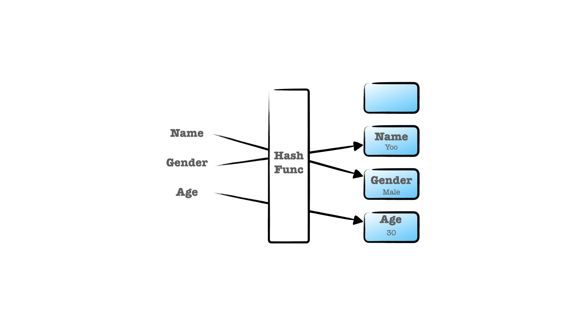

# Hash table

사물함, 키와 값을 받아 키를 해싱하여 나온 인덱스에 값을 저장하는 선형 자료구조이다. 삽입은 O(1)이며 키를 알고 있다면,
삭제 및 탐색도 O(1)로 수행한다. 테이블의 요소는 키와 값을 함께 가지고 있어야 한다.



### 해시 함수

해시 함수는 정해져 있지 않고 일반적으로 키(문자열)을 인덱스(숫자)로 변환할 수 있는 기능을 담은 함수면 충분하다.
이때, 서로 다른 키에 대해 동일한 결과를 반환한다면 '해시 충돌'이 발생한다.

### 해시 충돌 해결법

#### 선형 탐사법

충돌이 발생하면 옆으로 한칸 이동된 인덱스에 저장한다. 하지만, 옆으로 이동된 인덱스에도 값이 있을 경우 해당 요소의
한칸 옆으로 반복적으로 이동하게 되어 데이터가 한쪽으로 몰리게 되는 현상과 지속적으로 빈 요소를 찾아 이동되는 과정에서
최악의 경우 선형 시간 복잡도를 가지게 된다.

#### 제곱 탐사법

선형 탐사법에서 데이터가 한쪽으로 몰리게 되는 현상을 해결하고자 제곱 탐사법으로 사용할 수 있다. 제곱 탐사법은 충돌이
발생한 제곱만큼 이동하여 자료를 삽입한다.

#### 이중 해싱

충돌이 발생하면 기존 해시 함수를 대체할 수 있는 또 다른 해시 함수를 사용해서 인덱스를 구한다.

#### 분리 연결법

해시 충돌이 나도 해당 인덱스를 변경하지 않고, 요소를 연결 리스트로 만들어 해당 인덱스에 연결시켜 삽입한다.

### 해시 테이블 구현

#### 객체

```js
const table = {};
table['key1'] = 100;
table['key2'] = 'hello';

console.log(table['key1']) // 100
```

#### Map

```js
const table = new Map();
table.set('key', 100);
table.set('key2', 'Hello');

table.get('key');
table.keys(); // {"key", "key2"}
table.values(); // {100, "Hello"}
table.clear();
```

#### Set

```js
const table = new Set();
table.add("key");
table.add("key2");

table.has("key"); // true
table.size // 2
table.clear();
```
