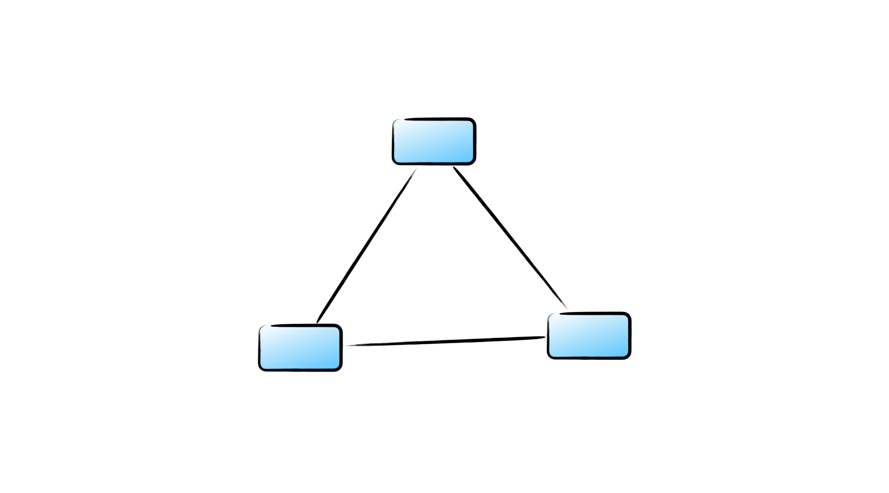

# Graph

페이지 링크, 조직도, 지하철 노선도

정점, 그리고 정점과 정점 사이를 연결하는 간선으로 이루어진 비선형 자료구조로서 정점들간의 관계를 간선으로 표현하는 구조이다.



### 그래프 구조의 특징

1. 정점은 여러 개의 간선을 가질 수 있다. 하나의 정점이 여러개의 정점과의 관계를 가질 수 있는 구조. 지하철 노선도에서
여러 환승 노선을 가진 역과 같다. 비선형 자료 구조의 특징.
2. 방향 그래프와 무방향 그래프가 있다.
3. 간선에 가중치를 가질 수 있다. 여러 간선이 있을때, 가중치가 높은 곳을 사용하여 해당 정점으로 이동해야 하는 규칙을 가지고
있을 수 있다.
4. 사이클이 발생할 수 있다. 

### 그래프 구조의 종류

1. 연결 그래프, 모든 정점이 서로 이동 가능한 상태인 그래프
2. 비연결 그래프, 특정 두 정점 사이에 간선이 존재하지 않는 그래프
3. 완전 그래프, 모든 정점끼리 연결 상태인 그래프, 특정노드와 관계하기 위해서 또 다른 특정 그래프를 거치는 것이 아닌
모든 정점끼리 연결되어 있는 구조로서 연결 그래프의 하위 집합
4. 사이클 그래프, 그래프의 정점과 간선의 부분 집합에서 순환이 되는 부분이 존재하는 그래프

### 그래프 구현 방법

그래프는 2차원 구조의 인접 행렬로 표현하거나, 연결 리스트 구조의 인접 리스트로 구현 가능하다.

#### 인접 행렬

정점의 갯수에 따라 2차원 구조의 배열을 만들고, 간선이 존재한다면 1 (true), 간선이 없다면 0 (false)로 채워준다. 만약 무방향 그래프라면 대칭되도록 간선 위치에 1 (true)를 채워주면 된다. 
다른 예로 가중치를 갖는다면, true, false가 아닌 가중치값을 넣어주면 된다.

```js
const graph = Array.from(Array(5), () => Array(5).fill(false));

graph[0][1] = true;
graph[1][2] = true;
graph[3][4] = true;
graph[4][2] = true;
graph[0][0] = true;

//무방향 그래프
graph[1][0] = true;
graph[2][1] = true;
graph[4][3] = true;
graph[2][4] = true;
graph[0][0] = true;

//가중치 간선 그래프
graph[0][1] = 6;
graph[1][2] = 3;
graph[3][4] = 1;
graph[4][2] = 2;
graph[0][0] = 5;
```

### 인접 리스트

```js
const graph = Array.from(Array(5), () => []);

graph[0].push(1) // 0 -> 1
graph[1].push(2) // 1 -> 2
graph[3].push(4) // 3 -> 4
graph[4].push(2) // 4 -> 2
graph[0].push(0) // 0 -> 0
```

### DFS, BFS의 시간 복잡도

그래프의 노드를 V, 엣지를 E 라고 하고,

- 인접 리스트 => O(V + E), 엣지를 순회해서 노드를 탐색한다.
- 인접 행렬 => O(V^2), 이중 for 문을 통해 V*V 행렬을 순회해서 탐색한다.


