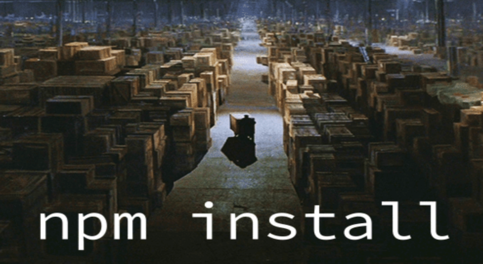
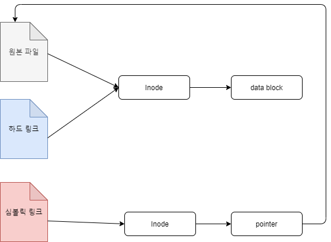

## **작성 동기**

---

최근 생산성 향상을 위해 추가된 ts-library-starter 저장소와, 파이브스팟 모노레포 POC 작업을 위해 생성된 fiverspot-mono 저장소에서 pnpm 패키지 매니저를 채택하였는데요. npm이 독점해왔던 패키지 매니저 시장에서 문제점을 지적하며 다양한 동기와 기발한 해결 방안으로 개선한 여러 패키지 매니저들이 등장하고, 그 선택권 또한 다양해졌습니다.

*본 글에서는 npm이 등장한 이래로 새롭게 추가된 패키지 매니저들의 핵심 전략을 알아보고 비교해보고자 합니다.*



## 자바스크립트 패키지 매니저

---

최초의 자바스크립트 패키지 매니저는 `npm` 이라는 이름으로 등장합니다. `pm (pkgmakeinst)` 이라 불리는 bash 유틸리티를 멘탈모델로 삼아 `node` 버전으로 만들어진 것인데요. `npm` 은 이후 등장하는 다양한 자바스크립트 패키지 매니저들이 어떤 기능들을 제공해야 하는지에 대한 핵심을 제공합니다.

*npm은 node package manager의 약자가 아닙니다.*

[GitHub - npm/cli: the package manager for JavaScript](https://github.com/npm/cli#is-npm-an-acronym-for-node-package-manager)

## 패키지 관리자가 제공하는 공통적인 기능들

---

패키지 매니저가 바뀌어도 낯설지 않게 사용할 수 있는 것은 공통적으로 일반적인 기능들을 제공하고 있고, 해당 기능들이 겉보이게는 큰 차이가 없기 때문인데요. 패키지 매니저들은 다음과 같은 기능들을 제공합니다.

**1. 메타데이터 작성 및 관리**

---

프로젝트에 대한 메타데이터(프로젝트명, 작성자, 라이센스 정보 등)을 관리할 수 있습니다. 패키지 매니저들은 일반적으로 `init` 명령어를 통해 초기 메타데이터를 입력받고, 프로젝트 최상단 `package.json` 파일로부터 이를 관리할 수 있도록 합니다.

```json
{
  "name": "Project Name",
  "version": "1.0.0",
  "description": "I want to get off work.",
  "main": "index.js",
  "scripts": {},
  "author": "youthfulhps",
  "license": "ISC",
  "dependencies": {}
}
```

**2. 의존성 패키지 추가, 업데이트, 삭제**

---

해당 프로젝트의 의존성 패키지를 추가 및 삭제를 손쉽게 제공하고, 버전 업데이트, 버전 지정 다운그레이드를 지원합니다.

- `install or add`

    ```bash
    ~$ npm install loadsh
    ~$ yarn add loadsh
    ```

- `uninstall or remove`

    ```bash
    ~$ npm uninstall loadsh
    ~$ yarn remove loadsh
    ```

- `update or upgrade`

    ```bash
    ~$ npm update loadsh
    ~$ npm upgrade loadsh
    ```


**3. 의존성 일괄 설치**

---

`package.json` 에 추가되어 있는 의존성 패키지들을 일괄적으로 설치할 수 있습니다. 일반적으로 특정 패키지를 명시하지 않은 설치 명령에 모든 의존성 패키지를 일괄 설치합니다.

```bash
~$ npm install
~$ yarn (생략 가능)
```

```json
{
  ...
  "dependencies": {
    "loadsh": "0.0.4"
  },
  ...
}
```

**4. 스크립트 실행**

---

직접 제작 혹은 패키지에서 제공하는 스크립트를 실행하거나, 실행 명령어의 별칭을 부여할 수 있습니다.

```jsx
console.log('Run script!')
```

```json
{
  ...
  "scripts": {
    "log": "node scripts/log.js"
  }
  ...
}
```

**5. 패키지 퍼블리시**

---

자체 제작한 패키지를 명명하고 이를 패키지화할 수 있습니다. (예시 추가 요망..)

**6. 보안 검사**

---

설치된 패키지의 보안 문제를 확인할 수 있는 기능을 제공합니다. 일반적으로 `audit` 를 사용하며 티켓으로 생성된 이슈 목록을 출력으로 제공합니다.

```bash
~$ npm audit
> === npm audit security report ===                        
                                                                                
> found 0 vulnerabilities
> in 1 scanned package
```

### etc

---

*예시보다 더 다양한 기능들을 `cli` 환경에서 사용해보실 수 있습니다.*

[CLI Commands | npm Docs](https://docs.npmjs.com/cli/v7/commands)

[Yarn](https://classic.yarnpkg.com/en/docs/cli)

[pnpm CLI | pnpm](https://pnpm.io/pnpm-cli)

## 선택의 기로에서

---

기본적으로 제공하는 공통적인 기능들이 겉보이게 크게 차이가 없기 때문에 사실 어떤 것을 사용해도 크게 문제되지 않지만, 다음과 같은 기준 잣대를 대볼 수 있습니다.

1. 설치 속도
2. 디스크 사용량
3. 레거시 워크 플로우 이전 과정에서의 호환성
4. 기능 외적인 요구 사항

*다음은 위 기준들에 있어 답변이 될 수 있는 패키지 매니저 각각의 배경과 장단점을 설명합니다.*

## npm

---

npm은 패키지 매니저의 선구자답게 초기버전은 장점이라 표현할 것 없이 우리가 흔히 알고 있는 `node_modules` 디렉토리를 통해 의존성을 설치 관리하는 방식을 구현하고, `package.json` 을 통해 메타데이터를 관리할 수 있는 개념을 제공합니다.

하지만 작은 프로젝트라도 수백 메가바이트를 차지하는 `node_modules` 로 인해 비효율적인 디스크 사용량을 보이기 쉽습니다. 이를 설치하고 검색하는 과정에서 `require.resolve.paths()` 함수에 의존하며 느리고 비효율적인 I/O 호출을 다수 만들어냅니다.


## yarn classic (yarn v.1)

---

위에서 언급한 npm의 문제점은 빙산의 일각이었고, 일관성과 보안, 성능 문제가 숨겨져 있었는데요. 페이스북은 구글을 비롯한 몇몇 개발자들과 함께 이를 개선하고자 하는 [커뮤니티](https://engineering.fb.com/2016/10/11/web/yarn-a-new-package-manager-for-javascript/)를 만들고, `Yet Another Resource Negotiator` 의 약자인 `yarn` 을 발표합니다.

https://github.com/yarnpkg/yarn

`yarn` 은 npm의 주요 문제점으로 언급되었던 설치 속도와 깊은 의존성 관계를 해결하고, 개발자 경험 관점 향상에 집중했습니다.

1. 모노 레포 기능을 자체적으로 지원합니다.
2. cache-aware (.yarn 파일)을 통해 캐시된 의존성 파일들을 재사용합니다.
3. lock files 도입으로 협업 환경에서 일관된 패키지 버전을 공유하고 설치할 수 있도록 합니다.
4. 설치 과정을 병렬화하여 설치 속도를 개선합니다.

### 의존성 호이스팅

---

추가적으로 `yarn` 은 깊어지는 의존성을 피하기 위해 중복된 의존성에 대해 호이스팅 기법을 적용합니다.


A(1.0)과 B(1.0)은 각자의 의존성에 의해 중복 설치되어 디스크 공간을 낭비하게 되는 문제를 해결하고자 중복된 B(1.0)를 의존성 트리의 최상단으로 끌어올립니다.

### 유령 의존성

---

디스크 공간을 세이브할 수 있다는 장점이 있지만, 프로젝트에서 `require()` 를 통해 모듈을 불러오고자 할때 의존성의 최상단에서 찾게 되는데 프로젝트의 직접 의존성으로 추가하지 않은 B(1.0) 또한 불러올 수 있게 되는 **유령 의존성(Phantom Dependency)** 현상이 발생됩니다. (`npm`에서도 `yarn`의 장점을 적용하여 프로세스를 개선하였고, 마찬가지로 유령 의존성 현상이 발생합니다.)

## yarn berry (yarn v.2)

---

`yarn` 은 v1을 유지보수 버전으로 변경하고 plug’n’play 전략을 도입한 v2를 `yarn berry` 로 칭합니다.

### **plug’n’play**

---

`yarn berry` 는 의존성을 생성하지 않고, `.yarn/cache` 폴더에 의존성 정보가 저장되고, `.pnp.cjs` 파일에 의존성을 찾을 수 있는 정보가 기록됩니다. 이는 의존성 검색을 위한 I/O 없이도 패키지가 어떤 패키지를 의존하는지, 각 라이브러리는 어디에 위치해있는지 알 수 있습니다.

```jsx
// .pnp.cjs 예시

/* react 패키지 중에서 */
["react", [
  /* npm:17.0.1 버전은 */
  ["npm:17.0.1", {
    /* 이 위치에 있고 */
    "packageLocation": "./.yarn/cache/react-npm-17.0.1-98658812fc-a76d86ec97.zip/node_modules/react/",
    /* 이 의존성들을 참조한다. */
    "packageDependencies": [
      ["loose-envify", "npm:1.4.0"],
      ["object-assign", "npm:4.1.1"]
    ],
  }]
]],
```

### **ZipFS (Zip Filesystem), Zero-Install**

---

`yarn berry` 에서 설치된 의존성은 `.yarn/cache` 에 압축파일로 관리됩니다. zip 파일로 의존성 관리를 하면 디렉토리 구조를 생성할 필요가 없어지고, 설치 속도와 디스크 용량을 아낄 수 있습니다. 압축을 통해 용량을 줄리고 의존성 또한 깃에서 트래킹하여 pull 이후 추가설치없이 사용할 수 있습니다.

하지만, 각각의 zip 파일 이름에 고유한 해시를 가지고 있어 지속적으로 압축파일이 추가된다는 점이 단점으로 꼽힙니다.

## pnpm

---

`pnpm`은 `npm` 설정을 바꿀 필요없이 바로 대체가능한 호환을 자랑합니다. `pnpm`은 `npm`, `yarn classic`에서 발생하는 의존성 중복 저장과 의존성을 플랫하게 만들기 위해 매우 복잡하게 동작하는 의존성 트리 검색, 설치 과정과 플랫하게 의존성 트리를 구축함에 따라 발생하는 사이드 이펙트를 언급합니다.

`pnpm`은 `Content-addressable-storage` 전략을 통해 `node_modules`의 의존성 깊이는 유지한채 심링크, 하드링크를 통해 의존성을 해결합니다.

실제로 데모 프로젝트에서 의존성을 추가하면,  `Content-addressable store`에 의존성이 추가되고, 실제 데모 프로젝트의 `node_modules`의 .pnpm에는 이를 가리키는 하드 링크가 담겨 마치 의존성이 설치되어 있는 것처럼 보입니다.

```jsx
~$ pnpm add loadsh
>
Packages: +1
+

Packages are hard linked from the content-addressable store to the virtual store.
  Content-addressable store is at: /Users/bhyoo436-fastfive/Library/pnpm/store/v3
  Virtual store is at:             node_modules/.pnpm

dependencies:
+ loadsh 0.0.4 deprecated

Progress: resolved 1, reused 0, downloaded 1, added 1, done
Done in 1.3s
```

```jsx
node_modules
  - .pnpm
  - loadsh
  - .modules.yaml
```

추가적으로 의존성이 설치되거나, 깊은 의존성은 이러한 심볼릭 링크를 연결합니다.


만약 두번째 데모 프로젝트에서도 이미 `Content-addressable store`에 추가된 의존성을 설치한다면, 다음과 같이 동일한 의존성을 가리키는 하드 링크를 생성하고 해당 의존성을 재사용합니다.

```jsx
~$ pnpm add loadsh
>
...
Progress: resolved 1, reused 1, downloaded 0, added 1, done
```

물리적으로 한번만 설치된 의존성을 모든 프로젝트에서 해결 가능한 방식으로 실제 사용자의 디스크의 상당한 공간을 절약할 수 있게 됩니다.

## 부록

### Symbolic Link vs Hard Link

---

pnpm 문서를 읽다보면 심볼릭 링크, 하드 링크 표현이 자주 등장합니다. pnpm 의존성 해결에 핵심이 되는데, 윈도우에서 특정 파일에 바로가기를 생성하는 개념과 같이 특정 파일에 접근할 수 있는 링크 정도로 가볍게 생각하면 이해하기 쉽습니다. 다만, 하드 링크는 원본파일과 같은 Inode를 가리키고 있어 원본 파일이 제거되어도 하드 링크가 가리키는 원본 파일 정보는 유지되어 계속 사용할 수 있습니다. 반대로, 심링크의 경우 Inode를 생성하고 원본파일을 가리키는 포인터 정보를 담기 때문에 원본 파일이 제거되면 실제 원본 파일에 접근할 수 없는 유효하지 않은 링크가 됩니다.



### Reference

---
- [동기 | pnpm](https://pnpm.io/ko/motivation)
- [npm, yarn, pnpm 비교해보기](https://yceffort.kr/2022/05/npm-vs-yarn-vs-pnpm)
- [[리눅스] Inode와 심볼릭 링크(Symbolic Link), 하드 링크(Hard Link) 개념과 실습](https://reakwon.tistory.com/142)
- [node_modules로부터 우리를 구원해 줄 Yarn Berry](https://toss.tech/article/node-modules-and-yarn-berry)
