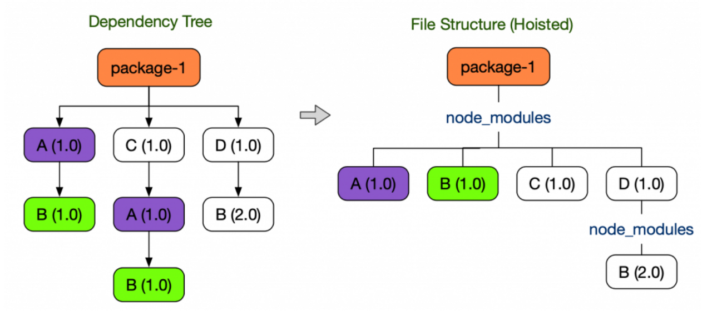

# Package Managers

모노레포를 적용하기 살펴보는 패키지 메니저들. npm 으로부터 시작한 패키지 매니저로부터 yarn classic, yarn berry,
pnpm 등등 선택지가 다양해졌다. 기본적으로 패키지 메니저의 역할, 그리고 모노레포들의 기능들을 자체적으로 제공하고 있지만
각기 다른 패키지 의존성 해결 방법, 패키지 호이스팅에 대한 보안 문제, 유령 의존성과 도플갱어 유발에 대한 문제를 해결하는
방법이 각기 다르다.

## 패키지 관리자가 제공하는 일반적인 기능들

### 1. 메타데이터 작성 및 관리

프로젝트에 대한 메타데이터(프로젝트명, 작성자, 라이센스 정보 등등)를 관리할 수 있다. 모든 패키지 메니저 명령어에 `init`
실행해서 초기 메타데이터를 삽입하면 생성되는 `package.json` 파일로 관리되는 정보들.

```json
{
  "name": "npm",
  "version": "1.0.0",
  "description": "NPM package manager example project",
  "main": "index.js",
  "scripts": {

  },
  "author": "youthfulhps",
  "license": "ISC"
}
```

### 2. 모든 의존성 일괄 설치 및 업데이트

`dependencies`로 나열된 패키지들을 일괄 설치하거나, 업데이트할 수 있다. `install` 명령어로 특정 패키지를
이후 입력으로 넣어주지 않으면 일괄 설치.

```shell
~$ npm install
```

```json
{
  ...
  "dependencies": {
    "loadsh": "0.0.4"
  },
  ...
}
```

### 3. 의존성 추가, 업데이트, 삭제

해당 프로젝트의 의존성을 추가, 업데이트, 삭제를 지원한다. `install` 명령어로 특정 패키지를 이후 입력으로
넣어주어 설치할 경우.

```shell
~$ npm install loadsh
~$ npm uninstall or rm loadsh
~$ npm update loadsh
```

### 4. 스크립트 실행

실행 명령어를 축약하여 작성된 스크립트를 실행할 수 있다.

```js
// scripts/log.js
console.log('Run script!');
```

```json
{
  "scripts": {
    "log": "node scripts/log.js"
  }
}
```

### 5. 패키지 퍼블리쉬

npm 로그인해서 자체 제작한 패키지에 대한 정보 입력, 이름 설정 후 `publish` 명령어로 패키지를 제작, 배포할 수 있다.
(간단한 예시 추가 요망..)

### 6. 보안 검사

npm 기준 `audit` 명령어를 통해 해당 패키지의 취약점 로그 확인, 자체적으로 취약 패키지를 확인할 수 있다.
yarn의 경우 프로젝트의 의존성이 충돌날 수 있는 특정 스크립트를 실행하거나 특정 패키지를 설치할 경우 다운로드를 막는 등과 같은 보안.
(예시가 더 있을듯.)

여러 패키지 관리자에서 제공하는 일반적인 기능들은 겉보기에 크게 차이가 없어보이지만, 자세하게 살펴보면 내부 동작이나 의존성 관리 측면에서
각기 다른 해결책을 가지고 있다. 더 자세하게 살펴보는 과정에서 의존성 관리의 멘탈 모델(?), 설치 속도, 디스크 사용량, 레거시 이관 호환성
등 외적인 요구 사항에 따라 패키지 매니저를 선택할 수 있다.

## npm 

수동으로 의존성을 설치하고 관리했던 과거에서 npm(pm이라는 bash 유틸리티의 node 버전)의 등장으로 패키지 관리를 손쉽게 할 수 있게 되었다.
위에서도 언급되었지만, 다음과 같이 우리가 패키지 매니저를 사용하고 있는 기본적인 기능들이나 개념이 npm에 의해 도입된 것이다.

1. `package.json`에 메타데이터를 담는다.
2. `node_modules` 폴더에 의존성 패키지를 설치하고 관리한다.
3. 커스텀 스크립트를 실행시킬 수 있다.
4. public, private 패키지.

### 유령 의존성

npm v3 에서 패키지들이 가지는 각각의 의존성 중복 설치를 방지하고자 공통으로 설치되는 패키지들을 호이스팅해서 의존성 트리를 플랫하게
만들어 중복 설치를 막는다. 다만, 여기서 의존성을 추가하지 않았으나, 대상 의존성의 의존성이 호이스팅되어 설치되는 현상이 발생한다.



## yarn classic

_yarn classic은 yarn berry (v2.x) 이전 버전 yarn v1.x 버전을 칭한다. (1.x 버전은 이제 유지보수 모드로 기능 추가 x)_

yarn은 npm의 일관성, 보안, 성능 문제를 해결하기 위한 페이스북에서 관리하는 패키지 매니저이다. `package.json`, `node_modules`
을 사용하는 것에서 확인할 수 있듯 기본적인 개념과 설계가 npm과 유사하다.

### 1. 속도 개선
직렬적으로 패키지를 설치하는 npm과는 달리 병렬적으로 패키지를 받아오기 떄문에 설치 측면에서 npm보다 비교적 빠르다. 
(npm v5.x 이후 버전부터는 큰 차이가 없다.)

### 2. 보안

npm은 자동으로 패키지에 포함된 다른 패키지들이 포함된다. 가령, loadsh 패키지에 담긴 의존성 또한 즉시 추가되게 되는데
yarn.lock 또는 package.json에 있는 파일만을 설치하여 의도치 않은 부가적인 의존성에 의해 발생할 수 있는 보안 이슈를 방어.

### 3. lock 파일

패키지를 설치하는 시점의 의존성 버전이 상이하여 버전별 차이로 인해 협업자와 일관된 개발이 어려움. 
lock 파일을 통해 패키지 추가 시점에 패키지 버전을 기록하고 잠궈버림. (npm은 package-lock.json)

```lock
# THIS IS AN AUTOGENERATED FILE. DO NOT EDIT THIS FILE DIRECTLY.
# yarn lockfile v1


loadsh@^0.0.4:
  version "0.0.4"
  resolved "https://registry.yarnpkg.com/loadsh/-/loadsh-0.0.4.tgz#5314babd12bb13315dde024a4ca70758c5489d2d"
  integrity sha512-U+wLL8InpfRalWrr+0SuhWgGt10M4OyAk6G8xCYo2rwpiHtxZkWiFpjei0vO463ghW8LPCdhqQxXlMy2qicAEw==
```

### 4. cache-aware 설치, 오프라인 캐싱

yarn에서 설치된 모든 것을 캐시에 저장한다 (`yarn/cache`). npm에 디스크 용량을 사용하지만, 이미 설치된 패키지들을
다시 설치하지 않고 사용할 수 있고 오프라인에서 재설치가 가능하다. 

### 5. native 모노레포

모노레포를 구성할 수 있는 workspace와 같은 기능을 제공하는데 아래서 자세히 살펴보자.

추가적으로 설치 순서에 상관없이 같은 의존성 트리가 생성되고, 큐를 사용하여 네트워크 요청 효율을 끌어올렸다.
특정 의존성 설치 성공 여부가 다른 의존성 설치에 독립적으로 설치되고, 실패한다면 설치 재요청을 한다.
패키지 중복 생성 방지를 위해 서로 다른 버전의 종속성을 단일 버전으로 플랫하게 해결.


## Reference

