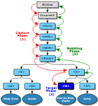

## 이벤트 위임

계층적 구조에 포함되어 있는 HTML 요소에 이벤트가 발생할 경우 연쇄적 반응이 일어난다. 이를 이벤트 전파 (Propagation) 이라 하며, 전파 방향에 따라
버블링 (Bubbling), 캡쳐링 (Capturing)이라고 한다. 

**자식 요소에서 발생한 이벤트가 부모 요소로 전파되는 것을 버블링**, 반대로 **자식 요소에서 발생한 이벤트가 부모 요소로부터 시작하여 이벤트를 발생시킨 자식 요소까지
도달하는 것을 캡쳐링**이라 한다. **주의할 점은 이벤트 전파가 버블링, 캡쳐링 중 하나가 발생하는 것이 아니고, 캡쳐링으로 시작하여 버블링으로 끝난다는 점이다.**



이벤트가 전파되는 과정에서 addEventListener 메서드의 세번째 매개변수를 true로 설정하면 캡쳐링으로 전파되는 이벤트를 캐치, false 혹은 미설정 시 버블링
단계에서 이벤트를 캐치한다.

이벤트 위임은 이벤트가 버블링되는 것을 전파를 통해 여러 자식 요소에 각각 이벤트 핸들러를 바인딩하는 대신 하나의 부모 요소에 이벤트 핸들러를 바인딩하는 방법이다.
이벤트 위임을 통해 이벤트가 각각 할당되는 메모리를 개선할 수 있고, 동적으로 추가, 제거되는 자식 요소에 대해 일일히 이벤트를 바인딩해줄 필요가 없다는 장점이 있다.

```js
<!DOCTYPE html>
<html>
<body>
  <ul class="post-list">
    <li id="post-1">Item 1</li>
    <li id="post-2">Item 2</li>
    <li id="post-3">Item 3</li>
    <li id="post-4">Item 4</li>
    <li id="post-5">Item 5</li>
    <li id="post-6">Item 6</li>
  </ul>
  <div class="msg">
  <script>
    const msg = document.querySelector('.msg');
    const list = document.querySelector('.post-list')

    list.addEventListener('click', function (e) {
    // 이벤트를 발생시킨 요소
    console.log('[target]: ' + e.target);
    // 이벤트를 발생시킨 요소의 nodeName
    console.log('[target.nodeName]: ' + e.target.nodeName);

    // li 요소 이외의 요소에서 발생한 이벤트는 대응하지 않는다.
    if (e.target && e.target.nodeName === 'LI') {
    msg.innerHTML = 'li#' + e.target.id + ' was clicked!';
  }
  });
  </script>
</body>
</html>
```


