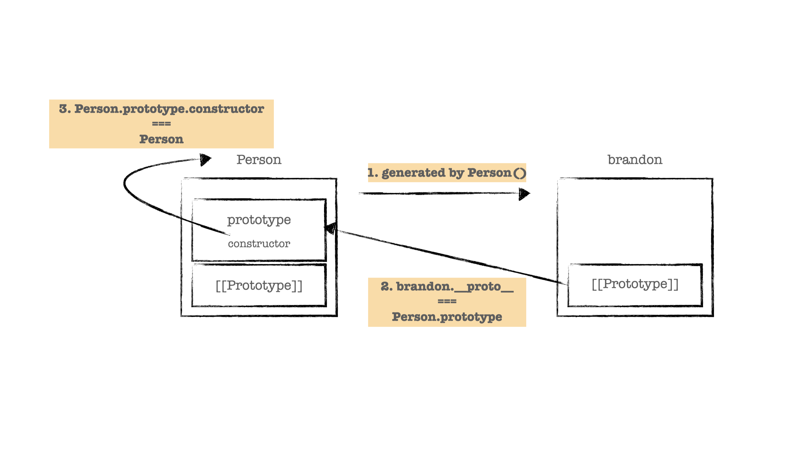
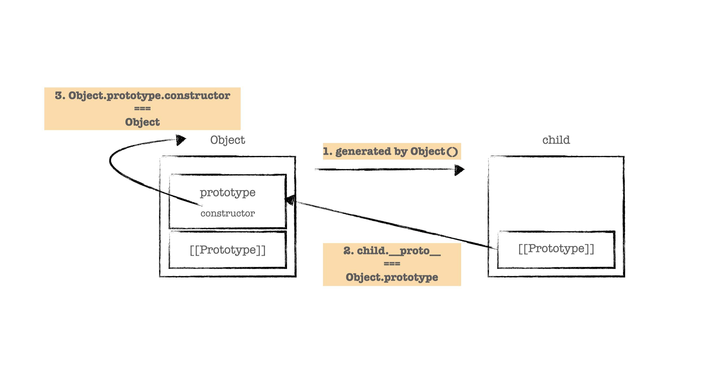
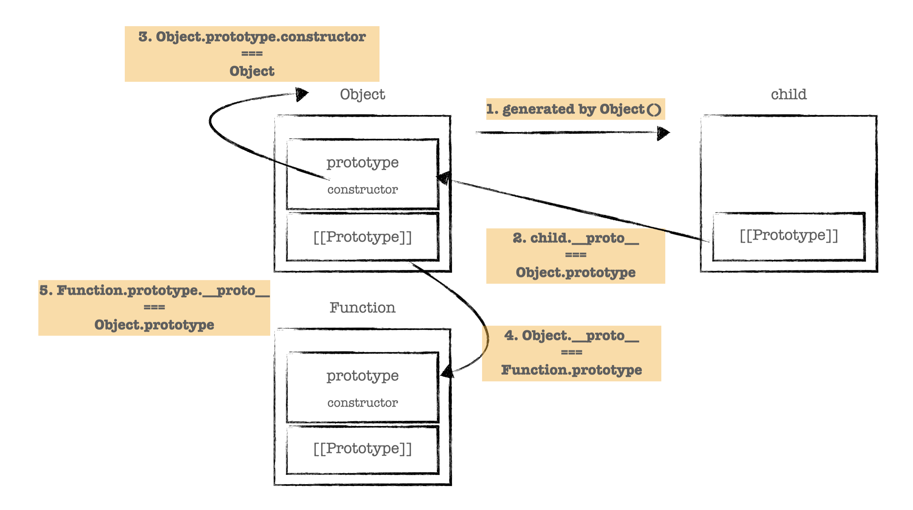
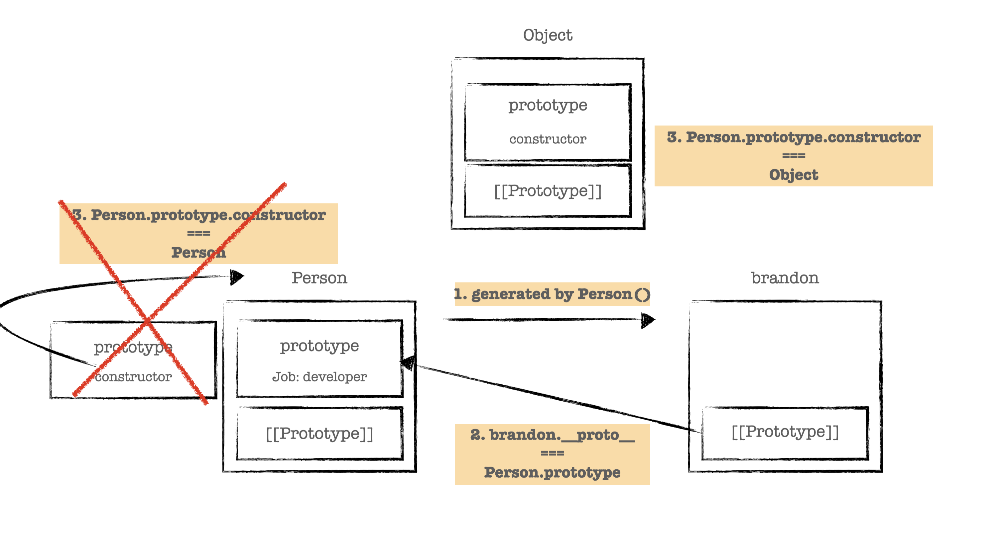

# 자바스크립트 프로토타입

자바스크립트는 프로토타입 기반의 객체 지향 프로그래밍 언어입니다. 개인적으로 프로토타입에 대한 큰 그림을 이해하고 있다고 생각했는데,
이직을 준비하면서 프로토타입만 마주하면 작아지는 제 모습을 보게 됩니다.

자연스레 프로토타입 객체로부터 상속받은 메서드를 사용하면서도, 직접 프로토타입 객체를 다룰 기회는 적었는데요.
어쩌면 가장 익숙하지만 낯선 프로토타입 기반을 다시금 공부해보려 합니다.

참고로, 이 글은 [프로토타입](https://poiemaweb.com/js-prototype)의 전개와 예시가 유사합니다.
저는 바이블처럼 여기는 [PoiemaWeb](https://poiemaweb.com/) 글을 참고하여 공부하며 정리하기를 좋아합니다.

### 객체, 그리고 프로토타입 객체

자바스크립트의 모든 객체는 자신의 부모격이 되는 객체와 연결되어 있습니다. 그리고, 자식 객체는 부모격이 되는 객체의 프로퍼티와 메서드를
마치 자신의 프로퍼티와 메서드처럼 사용할 수 있습니다. 객체 지향의 상속과 같은 패턴이죠!
자식 객체는 hasOwnProperty 메서드가 없음에도 호출할 수 있는 것처럼요. **여기서, 부모격이 되는 객체를 프로토타입 객체라 부릅니다.**

```js
const child = {
  name: "Brandon",
  age: 29,
};

console.log(child.hasOwnProperty("name")); // true
```

### [[Prototype]]

자식 객체는 어떻게 부모 객체의 프로퍼티와 메서드에 문제없이 접근하고 상속받을 수 있을까요? 자바스크립트의 모든 객체는 _[[Prototype]]_ 이라는
인터널 슬롯을 가지고 있고, 이를 통해 부모 객체를 참조하고 있어서 _[[Prototype]]_ 객체의 데이터 프로퍼티를 상속받을 수 있게 됩니다.

_[[Prototype]]_ 은 _\_\_proto\_\_ _ 접근자 프로퍼티로 접근할 수 있는데, 이는 Object.getPrototypeOf 가 내부적으로 호출되어
프로토타입 객체를 반환해준다고 합니다.


### prototype 프로퍼티

**함수 객체는 일단 객체와는 달리, _prototype_ 프로퍼티를 소유하고 있습니다.** 물론 _[[Prototype]]_ 도 가지고 있죠.

여기서, **_prototype_ 프로퍼티는 함수가 생성자 함수로서 호출되어 새롭게 객체를 생성할 때 생성된 객체의 프로토타입 객체를 가리키고 있습니다.**
쉽게 설명하자면, 새롭게 생성된 객체에게 프로토타입 객체를 참조할 수 있도록 전달해주는 역할을 합니다.


```js
function Person(name) {
  this.name = name;
}

const brandon = new Person("brandon");

console.log(brandon.hasOwnProperty("prototype")); // false
console.log(Person.hasOwnProperty("prototype")); // true

console.log(Person.prototype === brandon.__proto__); // true
```

### constructor 프로퍼티

프로토타입 객체는 _constructor_ 라는 프로퍼티를 가지고 있습니다. **_constructor_ 프로퍼티는 객체의 입장에서 자신을 생성한 객체를 가리키게 됩니다.**
가령, brandon 객체의 프로토타입 객체의 _constructor_ 프로퍼티는 Person 생성자 함수를 가리키게 되는데요. 아래와 같은 전개를 통해 참조됩니다.

- Person 생성자 함수를 통해 brandon객체가 생성된다.
- brandon 객체의 프로토타입 객체는 Person.prototype이다.
- brandon 객체의 프로토타입 객체 Person.prototype의 constructor 프로퍼티는 자신을 생성한 객체 즉, Person을 가리킨다.



```js
function Person(name) {
  this.name = name;
}

//Person 생성자 함수를 통해 brandon객체가 생성된다.
const brandon = new Person("Brandon");

//brandon 객체의 프로토타입 객체는 Person.prototype이다.
console.log(brandon.__proto__ === Person.prototype);

//brandon 객체의 프로토타입 객체 Person.prototype의 constructor 프로퍼티는 자신을 생성한 객체
//즉, Person을 가리킨다.
console.log(Person.prototype.constructor === Person);

// brandon 객체를 생성한 객체는 Person() 생성자 함수이다.
console.log(brandon.constructor === Person);

// Person() 생성자 함수를 생성한 객체는 Function() 생성자 함수이다.
console.log(Person.constructor === Function);
```

### 프로토타입 체인

자바스크립트는 특정 객체의 프로퍼티나 메서드에 접근하려고 할 떄 해당 객체에 접근하려는 프로퍼티 또는 메서드가 없다면,
_[[Prototype]]_ 이 가리키는 링크를 따라 자신의 부모 객체, 즉 프로토타입 객체의 프로퍼티 또는 메서드를 검색하게 됩니다.
**이러한 상속 개념의 패턴을 구현하기 위한 매커니즘이 프로토타입 체인이라 합니다.** 변수를 검색하는 메커니즘인
실행컨텍스트의 스코프체인과 유사한 역할과 동작을 띄고 있네요.

상단의 예시에서 child 라는 객체는 hasOwnProperty 메서드를 가지고 있지 않지만, 호출이 가능했던 것은 _[[Prototype]]_ 이 링크를 따라
Object.prototype를 참조하여 hasOwnProperty 메서드를 호출한 동작에 대한 근거가 됩니다.

```js
const child = {
  name: "Brandon",
  age: 29,
};

//child 객체는 hasOwnProperty 메서드를 가지고 있지 않지만, 호출이 가능하다.
console.log(child.hasOwnProperty("name")); // true

//child 객체의 프로토타입 객체는 Object.prototype이다.
console.log(child.__proto__ === Object.prototype); // true

//Object.prototype은 hasOwnProperty 메서드를 소유하고 있다.
console.log(Object.prototype.hasOwnProperty("hasOwnProperty")); // true
```

### 프로토타입 체인의 종점

그렇다면, **프로토타입 체인의 마지막 링크는 어떤 객체를 가리키고 있을까요?**
사실, 이 질문은 프로토타입을 깊게 이해하기 전 면접에서 받았던 질문인데요. 제가 프로토타입을 깊게 공부하도록 만든 질문이기도 합니다.

우선, 객체를 어떻게 생성하는 지부터 이야기해볼까요? 쉽게 객체를 정의할 수 있는 객체 리터럴 방식, 생성자 함수 그리고 Object() 생성자 함수로
객체를 정의합니다. 여기서 **객체 리터럴 방식은 결국 Object() 생성자 함수로 생성하는 것을 단순화한 축약 표현**이니, 내부적으로는 생성자 함수 그리고 Object() 생성자 함수를
통해 객체를 정의한다고 볼 수 있겠네요.

Object() 생성자 함수도 함수이니, _prototype_ 프로퍼티를 소유하고 있습니다. 즉, 아래와 같이 참조가 전개됩니다.



프로토타입 체인을 따라서 더 올라가볼까요? Object() 생성자 함수 또한 *[[Prototype]]*를 가지고 있고 다음과 같이 참조가 전개됩니다.

- Object 생성자 함수를 통해 child 객체가 생성된다.
- child 객체의 프로토타입 객체는 Object.prototype이다.
- child 객체의 프로토타입 객체 Object.prototype의 constructor 프로퍼티는 자신을 생성한 객체 즉, Object 생성자 함수를 가리킨다.
- Object.\_\_proto\_\_ 는 Function.prototype이다.
- Function.prototype.\_\_proto\_\_ 는 Object.prototype이다.



```js
// Object 생성자 함수를 통해 child 객체가 생성된다.
const child = {
  name: "Brandon",
};

// child 객체의 프로토타입 객체는 Object.prototype이다.
console.log(child.__proto__ === Object.prototype);

// child 객체의 프로토타입 객체 Object.prototype의 constructor 프로퍼티는 자신을 생성한 객체
//즉, Object 생성자 함수를 가리킨다.
console.log(Object.prototype.constructor === Object);

// Object.__proto__ 는 Function.prototype이다.
console.log(Object.__proto__ === Function.prototype);

// Function.prototype.__proto__ 는 Object.prototype이다.
console.log(Function.prototype.__proto__ === Object.prototype);
```

이번엔 객체를 생성하는 또 다른 방법으로 **생성자 함수를 통해 생성된 객체의 프로토타입 체인에 대한 전개를 확인해 보겠습니다.**

우선, 생성자 함수를 선언하는 단계부터 간단하게 알아보자면, 함수 선언식, 표현식 그리고 Function() 생성자 함수를 통해 함수를 선언할 수 있습니다.
함수 표현식은 가시적으로도 함수 리터럴 방식을 사용하고 있습니다. **함수 선언식의 경우 자바스크립트 엔진이 내부적으로 함수 기명 표현식으로 변환되어 사용됩니다.
즉, 함수 선언식, 표현식 모두 함수 리터럴 방식을 사용하고 있다고 할 수 있습니다.**

여기서 함수 리터럴 방식은 Function() 생성자 함수를 통해 함수를 선언하는 것을 단순화한 표현이니, 결국 함수 선언 방법 세 가지는 모두 Function() 생성자 함수를
통해 선언되는 것과 같습니다. 그럼, Function() 생성자 함수의 프로토타입 체인이 어떻게 전개되는 지 보겠습니다.

- Person 생성자 함수를 통해 brandon 객체가 생성된다.
- brandon 객체의 프로토타입 객체는 Person.prototype이다.
- Person 생성자 함수의 프로토타입 객체는 Function.prototype이다.
- Function.prototype의 프로토타입 객체는 Object.prototype이다.

```js
function Person(name) {
  this.name = name;
}

// Person 생성자 함수를 통해 brandon 객체가 생성된다.
const brandon = new Person("Brandon");

// brandon 객체의 프로토타입 객체는 Person.prototype이다.
console.log(brandon.__proto__ === Person.prototype);

// Person 생성자 함수의 프로토타입 객체는 Function.prototype이다.
console.log(Person.__proto__ === Function.prototype);

// Function.prototype의 프로토타입 객체는 Object.prototype이다.
console.log(Function.prototype.__proto__ === Object.prototype);
```

객체 선언 방식에 대한 프로토타입 체인을 거슬러 올라가 봤는데요. 객체 리터럴, 생성자 함수 방식이나 결국은 **모든 객체의 부모 객체인 Object.prototype 객체에서
프로토타입 체인이 끝나는 것을 확인할 수 있습니다. 그래서, 모든 객체의 프로토타입 체인의 종점은 Object.prototype 객체가 됩니다.**

### 프로토타입 체인의 동작

프로토타입 체인은 객체의 프로퍼티를 참조할 때 해당 객체에 프로퍼티가 없는 경우 프로토타입 체인이 동작합니다.
만약, 객체의 프로퍼티에 값을 할당하는 경우는 프로퍼티가 있다면 재할당을, 프로퍼티가 없다면 동적으로 할당되어 참조가 가능하기 때문에
이런 경우에는 프로토타입 체인이 동작하지 않습니다.

```js
function Person(name) {
  this.name = name;
}

Person.prototype.job = "junior developer";

const brandon = new Person("Brandon");
const max = new Person("Max");

max.job = "senior developer";

console.log(brandon.job);
console.log(max.job);
```

### 프로토타입 객체의 확장

위의 예제를 보면, Person.prototype에 'job'이라는 새로운 프로퍼티를 추가한 것을 확인할 수 있습니다.
프로토타입 객체는 객체이기 때문에 프로토타입 체인에 즉시 반영되는 프로퍼티를 추가/삭제할 수 있습니다.

```js
function Person(name) {
  this.name = name;
}

const brandon = new Person("Brandon");

Person.prototype.sayName = function () {
  console.log(this.name);
};

brandon.sayName();
```

추가적으로, 자바스크립트에는 객체 이외에도 기본형 값들에 대한 원시 타입이 존재합니다. 기본형들은 불면이며 메서드를 가지지 않는다는 점에서
객체와 구분되는데, 기본형인 string의 경우 메서드를 가지고 있는 것처럼 동작합니다.

```js
"primitive".charAt(3); // "m"
```

charAt은 분명 기본형 string의 메서드가 아니지만, 자바스크립트는 기본형과 객체 타입을 서로 자유롭게 변환합니다.
만약, 기본형에서 charAt에 접근하게 되면 자바스크립트는 기본형을 String 객체로 래핑하고, 메서드를 호출하고 마지막에 래핑할 때 사용했던 객체를
버립니다. **즉, 원시 타입으로 프로퍼티나 메서드를 참조하면 관련된 객체를 래핑하여 프로토타입 객체를 공유하게 됩니다.**

결론적으로, 원시 타입을 확장하고자 한다면 객체가 아닌 원시 타입에 프로퍼티나 메서드를 추가할 수는 없지만, 원시 타입과 관련된 객체의 프로토타입에 프로퍼티나
메서드를 추가하면 원시 타입에서도 공유받아 사용할 수 있게 됩니다.

```js
const str = "string";

str.sayValue = function () {
  console.log("string");
};

str.sayValue(); // TypeError: str.sayValue is not a function
```

```js
const str = "string";

String.prototype.sayValue = function () {
  console.log("string");
};

str.sayValue(); // "string"
```

### 프로토타입 객체의 변경

프로토타입 객체는 결정된 프로토타입 객체를 임의로 다른 객체로 변경할 수 있는데요. 프로토타입 객체의 변경 시점을 기준으로
이전에 생성된 객체는 기존 프로토타입 객체에, 이후에 생성된 객체는 변경된 프로토타입 객체에 바인딩되는 것을 주의해야 합니다.

프로토타입 객체가 변경이 되면, Person() 생성자 함수의 프로토타입 객체가 일반 객체로 변경되면서, Person.prototype.constructor가
제거되고, 프로토타입 체이닝에 의해 Object.prototype.constructor 인 Object() 생성자 함수로 변경이 됩니다.



프로토타입 객체를 임의로 변경해야 하는 일이 있을 지는 의문이지만, 사이드 이펙트는 없을 지 걱정부터 됩니다.

### 마치면서

가장 익숙한 것이 낯설게 느껴지는 프로토타입에 대한 공부가 아니었나 싶습니다. 전개를 쉽게 이해하고자 그림을 그려가면서 표현을 해봤는데요.
정확하게 표현을 한 것인지 잘못된 부분은 없는 지 다시 한번 확인해보면서 자주 꺼내볼 수 있는 글을 적게되어 매우 뿌듯합니다 :)
글에서 잘못된 이해로 인해 표현이 적절하지 않은 부분이 있다면 언제든 지적해주시면 감사하겠습니다.
