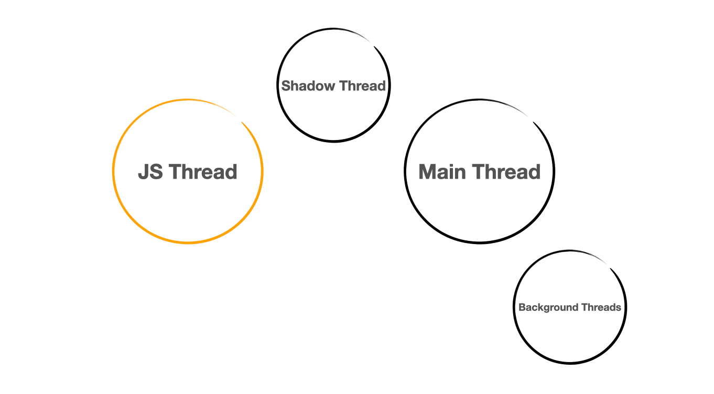
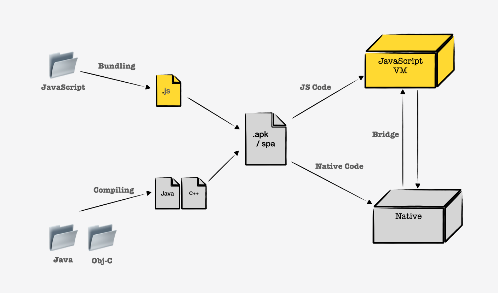
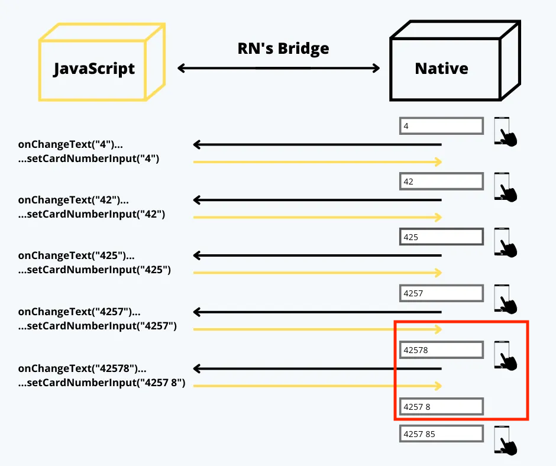
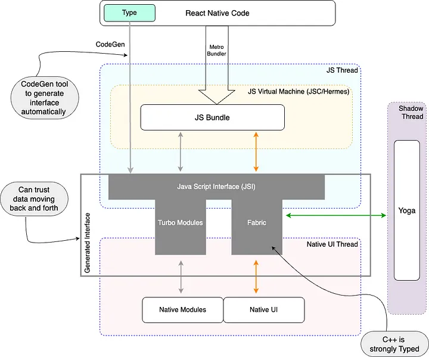
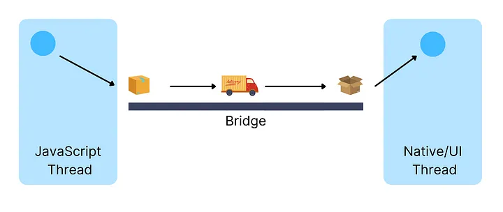
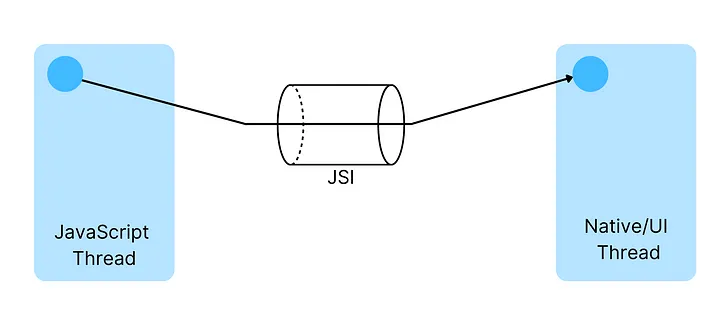
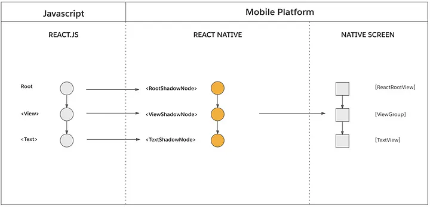

# 개요와 새로운 아키텍처

[React Native](https://reactnative.dev/)는 리엑트와 자바스크립트로 작성된 뷰를 iOS, 안드로이드의 네이티브한 영역에서 랜더링할 수 있는 기능을 제공하는 라이브러리이다. 
리엑트와 자바스크립트 생태계가 익숙하다면, 대표젹인 두 네이티브 앱을 시뮬레이팅하며 개발할 수 있다.

### 전반적인 동작 원리

리엑트 네이티브의 프로젝트는 자바스크립트 코드와 네이티브 코드 (*Java/Kotlin for Android, Objective-C/Swift of iOS*)로 이루어져있으며 두 코드 레벨이 함께 결합되어 동작한다. 
여기서 네이티브 코드는 네이티브에서 직접적으로 실행되며, 자바스크립트 코드는 가상 머신(VM) 위에서 동작한다.

iOS의 경우 C++로 작성된 JavaScriptCore라고 불리는 빌트인 자바스크립트 엔진을 가지고 있어 자체적으로 자바스크립트 코드를 컴파일하고 실행할 수 있다. 
반면, 안드로이드의 경우 내장된 자바스크립트 엔진이 없어 리엑트 네이티브로부터 자바스크립트 엔진을 함께 빌려 제공받는다.

**네이티브를 위한 언어 모델과 자바스크립트는 다른 프로그래밍 언어이기 때문에 서로 직접적으로 상호작용할 수 없다.**
리엑트 네이티브는 이러한 문제를 양쪽 언어가 모두 수용할 수 있는 형식(JSON)의 데이터를 통해 서로 상호작용할 수 있도록 하는데,
**이 소통을 중개하는 역할이 바로 Bridge이다.**

## 빌드와 런타임 (Build, Runtime)

빌드 시, Java 혹은 Objective-C로 작성된 네이티브 코드는 Java와 C++ 바이너리 파일로 컴파일되고, JavaScript 코드는 [Metro](https://reactnative.dev/docs/metro)를 통해 번들링된다. 
Metro는 Webpack 번들러와 유사하게 동작하지만, 리엑트 네이티브 환경에 최적화되어 있는 번들러이다. 
이렇게 얻어진 바이너리 파일들과 자바스크립트 번들은 최종적으로 대상 플랫폼에 적합한 파일로 압축된다.

런타임에서, JavaScript 코드는 JavaScript VM에서 실행되며, Native 코드는 해당 운영체제 장치에서 직접 실행된다. 
이때, Bridge를 통해 두 영역의 소통을 위한 직렬화된 메세지를 전송하고, 전달받은 메세지는 역직렬화하여 가공한다.

## 스레드 (Threads)

유저가 앱을 실행하면, 장치에서는 세개의 메인 스레드가 실행되고 필요한 경우 추가적인 백그라운드 스레드가 실행된다.

1. **Main Thread**, 메인 스레드는 앱이 실행되는 네이티브의 기본적인 스레드이다. 유저 인터렉션이나, 장치 스크린에 UI를 랜더링하는 주요한 작업을 담당한다. 메인 스레드는 빌드된 모든 앱에서 실행되는 동일한 스레드이다.
2. **JavaScript Thread**, 자바스크립트 스레드는 자바스크립트 혹은 리엑트 코드로 작성된 앱의 비즈니스 로직을 실행한다.
3. **Shadow Thread**, 쉐도우 스레드는 자바스크립트 스레드에 의존적으로 실행된다. 뷰의 위치를 계산하고, 자바스크립트 스레드에서 코딩된 레이아웃 트리를 구성한다. 리엑트 네이티브는 Yoga라고 불리는 레이아웃 엔진을 사용하는데, 레이아웃 시스템안에서 flexbox 기반으로 작성된 레이아웃을 네이티브가 이해할 수 있는 레이아웃 시스템 으로 변환한다.
4. **Native Modules Thread**, 네이티브 모듈 스레드는 앱에서 네이티브 플랫폼에서 제공하는 API에 접근해야 하는 경우 이를 처리하기 위한 스레드이다.

## 브릿지 (Bridge)

브릿지는 리엑트 네이티브 아키텍처에서 가장 중요한 요소이다. JSON 형식의 데이터를 통해 자바스크립트와 네이티브 레이어에서 서로 정보를 교환할 수 있도록 한다. 웹에서 프론트와 백엔드 레이어 간 서로의 상태와 정보,
혹은 어떤 언어로 작성되어 있는지와는 상관없이 원하는 정보만을 요청, 응답하는 것과 같이 브릿지는 자바스크립트 와 네이티브 레이어 간 데이터를 상호 교환할 수 있도록 한다.

1. 네이티브 디바이스에서 터치 이벤트가 발생한다.
2. 네이티브 영역에서 브릿지를 통해 해당 정보를 담은 직렬화된 메세지를 자바스크립트 영역으로 전달한다.
3. 자바스크립트 영역에서 직렬화된 메세지를 역직렬화하여 해당 정보를 전달받아 취해야 할 다음 액션을 결정한다.
4. 자바스크립트 영역에서 결정된 다음 액션을 마찬가지로 직렬화된 메세지를 통해 네이티브 영역으로 전달한다.
5. 네이티브 영역에서 직렬화된 메세지를 역직렬화하여 뷰를 업데이트한다.

## Problem with the Old Architecture

데이터 교환을 생산하는 레이어와 소비하는 레이어가 브릿지 상에서,

1. **비동기적으로 동작한다.** 브릿지상에서 직렬화된 데이터를 JSON 형식으로 교환하는 것은 매우 빠르게 동작하지만, 데이터 생산 레이어는 소비하는 레이어가 데이터를 역직렬화를 통해 데이터를 완전히 소비할 수 있을 때까지 대기해야 한다.
2. **싱글 스레드에서 작업을 처리한다.** 자바스크립트는 싱글 스레드를 사용한다. *리엑트 네이티브만의 문제는 아니지만, 근본적인 자바스크립트의 동작을 지적.*
3. **데이터 교환 방식에서 오버헤드가 발생한다.** 모든 데이터에 대한 교환은 직렬화와 역직렬화 작업이 추가된다. 자바스크립트 레이어의 코드 덩어리가 네이티브에서 동작하도록 고안된 기저의 데이터 교환 방식이었지만, 가볍고 단순한 JSON 형식을 채택했음에도 동작 자체에서 부과되는 오버헤드를 무시할 수는 없다.

더불어 네이티브 영역에서의 랜더링 → 자바스크립트 레이어로 데이터 전달 → 자바스크립트 레이어에서 데이터 처리 → 가공된 데이터를 통한 랜더링 정보를 다시 네이티브 영역으로 전달 → 네이티브 영역에서 전달받은 데이터를 통한 리랜더링 과정이 이루어진다면 리랜더링이 불가피하게 발생한다.

가령 4자리 마다 공백을 추가하는 카드 번호 입력기를 구현한다면, 입력값에 공백을 추가하는 로직을 처리하는 자바스크립트 레이어는 입력값에 대한 랜더링을 마친 네이티브 레이어로부터 데이터를 전달받고 이를 처리하기 때문에 랜더링이 두번 이루어지게 된다.

## 새로운 아키텍처

리엑트 네이티브 v0.68 버전부터 안정화된 새로운 아키텍처를 적용한다. 새로운 아키텍처에서 등장한 JSI, Fabric, Turbo Modules는 모두 브릿지를 활용한 구 아키텍처를 대체하고 자바스크립트 엔진에서 네이티브 메서드 및 객체를 직접 참조하고 호출할 수 있도록 개선하기 위한 구현체들이다.

새로운 아키텍처를 통해 얻을 수 있는 대표적인 개선점들을 다음과 같이 설명하고 있다.

1. **동기적으로 동작한다.** 브릿지로 인해 동기적 작업이었지만, 비동기적으로 동작해야만 했던 작업들을 이제 동기적으로 수행할 수 있다.
2. **동시성을 제공한다.** 자바스크립트에서 다른 스레드에서 실행되는 함수를 호출할 수 있다.
3. **오버헤드를 줄일 수 있다.** 더 이상 데이터 통신을 위해 직렬화/역직렬화를 할 필요가 없다.
4. **코드 공유**, C++을 도입함으로써 플랫폼에 구애받지 않는 모든 코드를 추상화하고 플랫폼 간에 쉽게 공유할 수 있다.
5. **타입 안정성**, JS가 C++ 객체에 메서드를 올바르게 호출할 수 있도록 하고, 그 반대의 경우도 가능하도록 자동으로 생성된 코드 레이어가 추가되었다.

## JSI (JavaScript Interface)

JSI는 자바스크립트 엔진이 네이티브 영역의 메서드를 직접 참조하고 호출하는데 사용할 수 있도록 C++로 작성되어 있는 인터페이스이다. 기존 아키텍처의 브릿지는 JavaScriptCore 엔진을 사용하는데, 이는 특정 자바스크립트 엔진만 지원하는 한계가 있었다. JSI는 자바스크립트 인터페이스에서 벗어난 인터페이스로 Chakra, v8, Hermes와 같은 여러 자바스크립트 엔진에서 범용적으로 사용 가능하다.

그렇다면 JSI는 어떻게 자바스크립트에서 네이티브 메서드를 직접 호출할 수 있을까? JSI는 C++ 호스트 객체를 통해 네이티브 메서드를 노출시켜 자바스크립트에서 참조 가능하도록 한다. 브라우저 환경에서 동작하는 자바스크립트에서 DOM과 BOM를 참조할 수 있는 것과 유사하다.

요약하자면, JSI는 JavaScriptCore 엔진에 한정되지 않고 다양한 자바스크립트 엔진에서 범용적으로 사용될 수 있으며, 네이티브 메서드와 객체를 직접 자바스크립트 스레드에서 작업 가능하여 직렬화/역직렬화된 JSON 데이터를 통해 통신하는 오버헤드를 제거할 수 있다.

외람될 수 있지만, JSI가 C++로 작성되었다는 것은 리엑트 네이티브가 스마트 TV, 워치와 같은 플랫폼을 대상으로도 활용할 수 있다는 확장성을 내제하고 있다.

## Fabric

Fabric은 현재 UI 매니저를 대체할 랜더링 시스템이다. Fabric을 살펴보기 전에 기존 랜더링 시스템에 대해서 간단하게 살펴보자.

앱이 실행되면 리엑트로 작성된 코드를 실행하여 ReactElementTree를 생성한다. 이 트리를 기반으로 랜더러는 C++로 ReactShadowTree를 생성한다. 여기서 ReactShadowTree는 레이아웃 엔진에서 네이티브 화면을 구성하는 UI 요소의 위치를 계산하는 데 사용된다. 이후 레이아웃 계산 결과를 사용할 수 있게 되면, ReactShadowTree는 비로소 네이티브 UI 요소로 구성된 HostViewTree로 변환된다.

(ex. <View /> in react native → *ViewGroup in Android & UIView in iOS respectively*)

기존 랜더링 시스템의 문제도 브릿지와 관련이 깊다. JS와 UI 스레드가 동기화되어 있지 않기 때문에 랜더링 작업 과정에서도 브릿지를 통해 랜더링에 필요한 데이터들을 두 레이어 간 통신을 통해 주고 받는다. 이러한 랜더링 과정은 가령 무한 스크롤이 가능한 리스트에서 빠르게 스크롤을 발생시키면 브릿지가 과부하되어 차단되는 현상으로 인해 앱의 프레임을 떨어뜨리고 프레임이 건너뛰어지는 현상이 발생한다.

[랜더링 점프 현상](https://javascript.plainenglish.io/analysis-of-react-native-new-architecture-with-results-1c157ab9c9c8#Analysis)

새롭게 구현된 Fabric 랜더링 시스템은 C++로 구현되어 JSI에서 언급한 것처럼 네이티브의 UI 메서드 또한 직접 참조할 수 있게 되어 각각의 호스트의 뷰와 리엑트 뷰 간 향상된 상호 운용이 가능하고, 이를 동기적으로 측정하고 랜더링한다. (비동기적으로 리엑트 뷰를 네이티브 뷰로 변환하는 과정에서 발생하는 레이아웃 점프 이슈 개선)

추가적으로,

1. 모든 작업이 우선순위를 가지고, 동기적인 이벤트 지원을 통해 사용자와 상호작용의 우선순위를 지정하여 우선 순위가 높은 작업을 먼저 처리할 수 있도록 설계되었다. (React v18 버전의 메이저 업데이트 중 동시성 메커니즘과 유사)
2. 리엑트 Suspense와의 결합을 통해 보다 유려한 데이터 패칭 로직 전개가 가능해졌다.
3. 리엑트에서 제공하는 동시성 기능들이 리엑트 네이티브에서도 구사 가능하다.

[더 많은 개선점들](https://reactnative.dev/architecture/fabric-renderer)

## Turbo Modules

Turbo Modules은 기존 NativeModule을 대체하는 새로운 네이티브 모듈이다. 가령 각각의 플랫폼에서의  bluetooth, geo location, file storage가 그 예시이다. Turbo Modules은 브릿지를 사용하는 기존의 네이티브 모듈을 대체한다.

1. 각각의 플랫폼 언어와 통합하여 C++로 네이티브 모듈을 작성할 수 있어 각각의 플랫폼에서 동작 가능한 네이티브 모듈을 구현해주어야 하는 중복을 줄였다.
2. 플랫폼 전반에서 보다 강력한 타입 인터페이스로 접근할 수 있다.
3. 네이티브 모듈의 레이지 로딩이 가능해진다. 가령 구현된 앱에서 geo location 네이티브 모듈이 필요하지 않아도 적재된 상태여야 했다. 이제 필요할때만 네이티브 모듈을 레이지하게 로딩하여 사용할 수 있다.

[Turbo Module을 구현하는 방법](https://reactnative.dev/docs/the-new-architecture/pillars-turbomodules#how-to-create-a-turbo-native-module)

## CodeGen

동적인 자바스크립트와 정적인 C++로 구현된 JSI가 상호운용되기 위해 둘 사이의 의사소통의 동기화가 보장되어야 한다. 위에서 지속적으로 강력한 타입 인터페이스와 체커를 제공한다는 이야기들의 구현체이기도 하다. Codegen은 자바스크립트와 C++이 안전하게 상호 운용되는데 필요한 인터페이스를 자동으로 생성하는데 사용되는 도구이다.

Codegen은 필수 요소는 아니지만, 사용한다면 android/ios 빌드가 이루어질 때 하나의 작업으로 포함되며, 기저에 필요한 코드들을 생산하는데 많은 시간을 절약하는데 도움을 준다고 설명한다.

## Reference

---

- https://medium.com/front-end-weekly/how-does-react-native-work-understanding-the-architecture-d9d714e402e0
- https://reactnative.dev/docs/the-new-architecture/landing-page
- https://javascript.plainenglish.io/analysis-of-react-native-new-architecture-with-results-1c157ab9c9c8#Analysis
- https://medium.com/coox-tech/deep-dive-into-react-natives-new-architecture-fb67ae615ccd
- https://medium.com/@karanbalodi/javascript-interface-jsi-overview-and-need-for-re-architecture-of-react-native-6ab6a7b3f660

