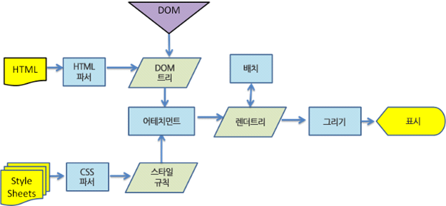

# Virtual DOM

## TL;DR

1. 가상 DOM은 재조정 과정에서 가상으로 설계된 DOM의 표현을 메모리에 저장하고, 실제 브라우저에 동기화시키는
일련의 과정을 추상화한 프로그래밍 개념
2. 가상 DOM에 작성된 엘리먼트 트리들은 실제 랜더링되지 않기 떄문에 실제 DOM에 직접 적용하는 것보다 비교적 적은 비용이 든다.
3. 상태 업데이트에 대한 리랜더링을 즉시 발생시키지 않고 작업 예약을 한다. 매우 짧은 시간 안에 산발적으로 발생한
다량의 리랜더링 트리거 작업들을 모두 묶어(Batching) 새로운 가상 DOM을 작성하고, 이를 이전에 사용된 가상 DOM과 비교하여
의도한대로 실제 DOM에 적용되어야 하는 변경 사항들만을 수집한다. (Reconciliation)
4. 재조정 단계에서 이전, 최신 가상 DOM에 적용된 엘리먼트 트리는 최적화된 알고리즘을 통해 비교적 빠르다.

## Virtual DOM

[리엑트 공식 문서](https://ko.legacy.reactjs.org/docs/faq-internals.html#gatsby-focus-wrapper)
에서 가상돔에 대해 다음과 같이 설명하고 있어 쉽사리 단언하기 어렵지만

> “virtual DOM”은 특정 기술이라기보다는 패턴에 가깝기 때문에 사람들마다 의미하는 바가 다릅니다.

정의해보자면, 가상돔은 재조정 (Reconciliation) 과정에서 가상으로 설계된 DOM의 표현을 메모리에 저장하고, 
실제 브라우저에 동기화시키는 일련의 과정을 추상화한 프로그래밍 개념 혹은 가상으로 설계된 DOM 그 자체를 지칭하는 
명사로 이해할 수 있다.

### 1. Real DOM의 동작은 느리지 않다.

사용자의 요청에 의해 서버로부터 전달받은 웹 문서는 텍스트로 구성되어 있다. 이는 브라우저의 랜더링 엔진에 의해
브라우저가 이해할 수 있는 구조로 변환, 구성되는데 이를 DOM이라 한다. HTML5 기반으로 분석된 모든 요소와 속성,
텍스트를 각각 객체로 구성하고 이들의 부자 관계를 표현한 트리구조이다.

가상돔의 장점을 설명할때 '실제 DOM보다 빠르다'라고 표현하기 때문에 비교적 DOM에 가해지는 작업 처리가 느리겠거니
생각하기 쉬운데, 사실 실제 DOM의 동작은 빠르다. 다만, 변경된 DOM 구조에 의해 랜더링 엔진에서 재적용(랜더트리
생성, 리플로우, 리페인팅 등등)의 작업이 비싸기 때문에 '느리다'라고 표현된 것.



결론적으로, 가상 DOM은 실제 DOM의 동작이 느리거나 문제가 있어서 등장하게 된 것이 아니라, 보다 효율적인 랜더링
사이클을 고안된 기법들을 적용하기 위한 임시 버퍼 혹은 그 대상인 것.  

### 2. 효율적인 랜더링과 재조정

1. 가상의 DOM은 실제 DOM과는 다르게 랜더링을 하지 않는다. 그만큼의 비용을 절감.
2. 산발적으로 발생하는 업데이트를 배칭하여 변경 사항을 일괄 적용한다. 랜더링 횟수를 최소화하여 그만큼의 비용을 절감.
3. 업데이트로 인해 새롭게 생성된 엘리먼트 트리와 이전에 적용되어 있는 엘리먼트 트리를 효율적으로 비교.

JSX로 작성된 리엑트 엘리먼트는 다음과 같은 객체로 변환된다. 해당 엘리먼트는 객체가 생성된
특정 시점의 상태와 UI 정보를 가지고 있는 불변 객체로서 해당 자식 속성들을 변경할 수 없다.

```js
<div id='test'>Element!</div>
```
```text
{
  $$typeof: Symbol(react.element),
  key: null,
  props: {children: 'Element!', id: 'test'},
  ref: null,
  type: "div",
  _owner: FiberNode {tag: 0, key: null, stateNode: null, elementType: ƒ, type: ƒ, …},
  _store: {validated: true}
}
```

해당 엘리먼트가 업데이트되면, 엘리먼트 정보가 담긴 새로운 불변 객체를 생성하고 `render()`에 전달하여 
갱신하는 방법밖에 없다. `render()`는 전달받은 엘리먼트 정보를 통해 새로운 엘리먼트 트리를 생성하는데, 
이를 이전에 사용된 트리와 비교하여 실제 DOM에 적용되어야 할 변경사항을 찾아내는 과정을 거친다.

### 비교 알고리즘

n개의 엘리먼트로 구성된 하나의 트리를 다른 트리로 변환하기 위한 연산 비용은 O(n*3) 복잡도를 가지며 
상당히 비용이 비싸기 때문에 효과적인 알고리즘이 필요하다.

1. 랜더링을 요구하는 각각의(이전, 최신) 트리의 동일 지점의 엘리먼트의 타입이 다르면, 이전 트리를
버리고 완전히 새로운 트리를 구축한다. (children 등 타 속성들이 모두 같아도 상단 루트 태그의 
타입이 바뀌면, 그리고 여기서 타입은 위에 작성해둔 엘리먼트 불변 객체의 키 중 하나 ("div", "span", _f_ ComponentA))

```jsx
// as-is
<div id='test'>Element!</div>

// to-be
<span id='test'>Element!</span>
```
```jsx
// as-is
<div>
   <Component />
</div>

// to-be
<span>
   <Component />
</span>
```

이전 트리의 노드가 컴포넌트 인스턴스라면, 파괴하기 위해 `componentWillUnmount()`, 이후 새로운 트리가
만들어질때 `componentDidMount()`가 실행된다.

2. 엘리먼트 타입이 같다면, 동일한 내역은 유지, 변경된 속성들만을 골라 업데이트한다.

```jsx
// as-is
<div className="open" />

// to-be
<div className="close">
```

이때 엘리먼트가 컴포넌트 인스턴스라면, 랜더링 사이에 내부 state가 유지되고 컴포넌트 props가 갱신된다. 
해당 인스턴스의 `componentWillReceiveProps()`, `componentWillUpdate()`, 
`componentDidUpdate()`가 호출된다.

3. 자식 엘리먼트들의 재귀적인 비교 과정에서 일치점을 찾고 해당 시점에서 새롭게 추가된 자식 엘리먼트를 
트리에 추가해낸다.

```jsx
// as-is
<ul>
  <li>first</li>
  <li>second</li>
</ul>

// to-be
<ul>
  <li>first</li>
  <li>second</li>
  <li>third</li>
</ul>
```

### key 속성의 역할

대상 컴포넌트로 전달되는 `key` 속성 값은 실제 컴포넌트로 전달되는 속성이 아니지만, 이를 통해 
재조정 과정에서 특정 컴포넌트 타입의 특정 인스턴스를 구분할때 사용된다.
map과 같이 순회 형태로 자식 컴포넌트를 생성할때 자식 컴포넌트들의 타입은 동일하지만, 각각의
key값을 통해 이전, 최신 엘리먼트 트리에서 동일한 컴포넌트 타입의 리스트 속에서 비교 대상을
선정할 수 있다. 

하지만 데이터를 추가, 삭제, 순서 변경에 의해 변경될 수 있는 데이터를 랜더링하는 경우 `index`
를 통한 키값 할당은 피해야 한다. 가령,

1. `<Item />` 컴포넌트 10개 랜더링, 해당 인덱스(0~9)를 키값으로 할당
2. 이후 3, 4번째 제거, 새로운 데이터 3개 추가
3. 2번 과정은 랜더링을 담당하는 리엑트 입장에서 `<Item />` 컴포넌트가 하나 추가된 것에 불과하며
제거된 3, 4번에 의해 5번째 아이템 컴포넌트가 3번 키값을 가지게 됨

디핑 알고리즘에 의해 최신, 이전 엘리먼트 트리를 비교할 때 동일한 3번 키값을 가지고 있기 때문에
이전에 사용된 3번의 아이템 컴포넌트 인스턴스를 그대로 사용하게 되고 의도한 랜더링 동작이 리엑트에
요구되지 않을 수 있다.

## Reference

- https://poiemaweb.com/js-dom
- https://d2.naver.com/helloworld/59361
- https://yceffort.kr/2022/04/deep-dive-in-react-rendering

