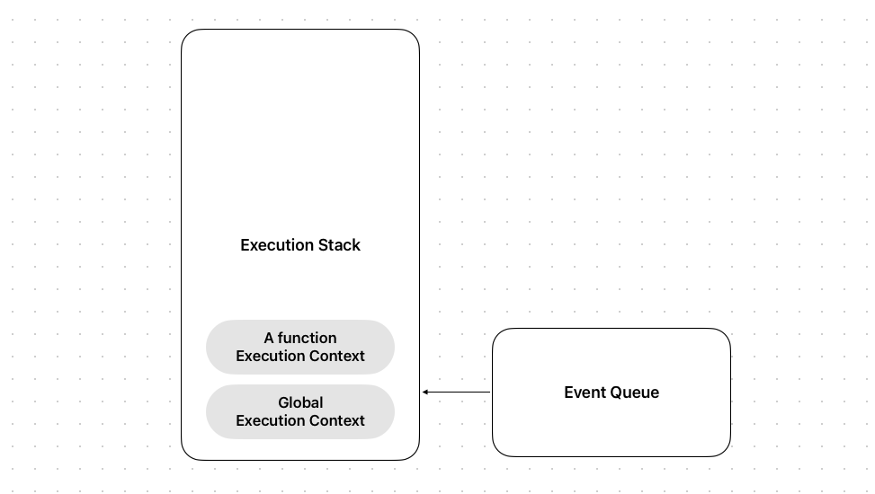

# Fiber

동시성 기능 + 기존 Stack Reconciler를 보완한 리엑트의 새로운 재조정 엔진.

## Stack Reconciler

LIFO 메커니즘으로 동작하는 스택 데이터 아키텍처를 기반으로 설계된 기존 스택 리콘실러 구조상 모든 작업을 동기적으로
스택에 쌓인 텍스크를 처리했다. 

`render(...)`를 통해 전달된 컴포넌트 혹은 네이티브 타입의 리엑트 엘리먼트 트리는 기존에 적용되어 있던 엘리먼트 트리와
재조정하는 과정을 거쳐 비교하게 되는데, 엘리먼트 트리의 루트부터 children을 재귀적으로 순회하고 변경된 사항을 랜더러에게
실제 DOM 노드의 변경이 필요한 부분을 커밋한다.

재조정 알고리즘은 재귀 알고리즘 방식으로 동작하는데, 피보나치 수열을 구하는 재귀 구조의 함수처럼 매우 깊은 콜스택이 형성된다.

```js
function fib(n) {
  if (n < 2) {
    return n;
  }
  return fib(n - 1) + fib(n - 2)
}

fib(10)
```

```
| fib(1) |
| fib(2) |
| fib(3) |
|  ...   |
----------
```

하나의 부모 엘리먼트의 업데이트는 이하 children에 속하는 엘리먼트 트리를 재귀적으로 비교하기 때문에 마찬가지로 매우
큰 콜스택이 형성되게 되는데 이 과정은 어쩌면 비효율적일 수 있다.

1. 부모 엘리먼트의 업데이트를 포함한 재귀적으로 업데이트가 필요한 children의 업데이트를 모두 즉시 반영할 필요가 없으나,
변경사항을 푸시하는 모든 작업을 동기적으로 하나의 큰 텍스크로 실행된다.
2. 잦은 리랜더링 + 내부적인 라이프 사이클의 호출로 재조정이 발생할 여지가 매우 잦은데, 이로 인해 깊은 콜스택이 형성되나
단일 스레드라는 점에서 부하가 걸린다.
3. 덩치가 큰 작업 처리 과정에서 이후 스택에 쌓인 작업들이 많은 시간을 대기하게 되어 사용자 관점에서 가장 자연스러운 
60 프레임을 따라가지 못한다.

## Fiber Reconciler

스택 리콘실러에서 언급된 문제점들을 해결하고자 제작된 재조정 엔진이다. 동기에 걸맞게 다음과 같은 메커니즘을 해내야 한다.

1. 작업을 중단하고 나중에 다시 돌아올 수 있어야 한다.
2. 다른 종류의 작업에 우선순위를 부여할 수 있어야 한다.
3. 이전에 완료된 작업을 재사용할 수 있어야 한다.
4. 더 이상 필요 없어지면 작업을 중단할 수 있어야 한다.

잠시 자바스크립트 엔진의 실행 스택과 이벤트큐의 구조와 동작을 간단하게 살펴보자.



1. 스택 구조로 호출된 함수의 실행 컨텍스트가 생성되고 실행 스택에 쌓인다. (가장 먼저 글로벌 실행 컨텍스트)
2. 비동기적인 (setTimeout, API call) 등의 동작들은 이벤트 큐에 콜백이 쌓인다.
3. 현재 실행 스택에 쌓인 작업이 없거나, 글로벌 실행 컨텍스트만 남아있는 경우 이벤트 큐의
작업을 가져와 실행 스택에서 추가한다.

리엑트에서 Fiber (가벼운 실행 스레드)는 마치 위와 같이 동작하며 이 메커니즘 자체를 지칭한다.
하나의 큰 작업 (노드부터 children를 재귀적으로 순회하고 비교) 을 잘개 쪼개고 이를 스택에 쌓는다.
이 각각의 프레임들은 fiber라고 칭하는 객체 구조로 생성된다.

(Fiber는 메커니즘 자체 혹은 각각의 쪼개진 작업의 단일 프레임을 지칭하고 있다. 레퍼런스들에서는 대소문자를
사용해서 구분짓고 있는데, 명확한 표현이 있는지 궁금. + 자바스크립트 엔진의 구조를 가져와 설명한 것은 리엑트
자체적으로 리엑트에 특화된 콜스택, 스택 프레임을 처리하는 메커니즘을 Fiber라는 이름으로 칭하고 구현한 것 같다.
쪼개진 작업을 처리하고, 스케쥴러에 쌓인 작업들 중 우선순위가 높은 작업이 있는지 일정 시간, 혹은 isInputPending과
같은 API를 통해 한번씩 확인하는 과정이 포함되어 있는 것이 비슷하다는 것 같음.) 

## Fiber 노드

각 Fiber는 컴포넌트 인스턴스의 입출력에 대한 정보를 담고 있고 객체로 구성되어 있다. 
리엑트 모든 요소는 render를 통해 Fiber 인터페이스를 가진 객체로 반환된다. 
잘개 쪼개진 작업을 fiber라고 한다면, 각각의 fiber들은 이후 작업(child, sibling)의 정보를
가지고 있으며 자신을 가리키고 있는 부모의 fiber 정보 또한 가지고 있다.

Fiber 노드는 리엑트 컴포넌트의 인스턴스를 표현한다. 객체로 구성되어 있으며 해당 인터페이스는 [여기](https://github.com/facebook/react/blob/main/packages/react-reconciler/src/ReactInternalTypes.js#L83)
서 확인 가능하다.

1. type은 엘리먼트 타입을 표기한다. 네이비트 엘리먼트 타입 혹은 리엑트 컴포넌트 타입.
2. key, 자식 엘리먼트가 가지는 유니크한 키.
3. child, 자식 엘리먼트의 fiber를 가리킨다.
```tsx
function Parent() {
  return <Child />
}
}
```

4. sibling, render가 반환하는 엘리먼트 목록
```tsx
function Parent() {
  return [<Child />, <Child />]
}
```

5. Return
- type, 엘리먼트 타입을 표기한다. 네이티브 엘리먼트 혹은 리엑트 컴포넌트 타입
- key, 자식 엘리먼트가 가지는 유니크한 키
- child, Fiber의 child 키값의 인터페이스는 Fiber다. 
  - ```ts
    function Parent() {
    return <Child />
    }
    ```


