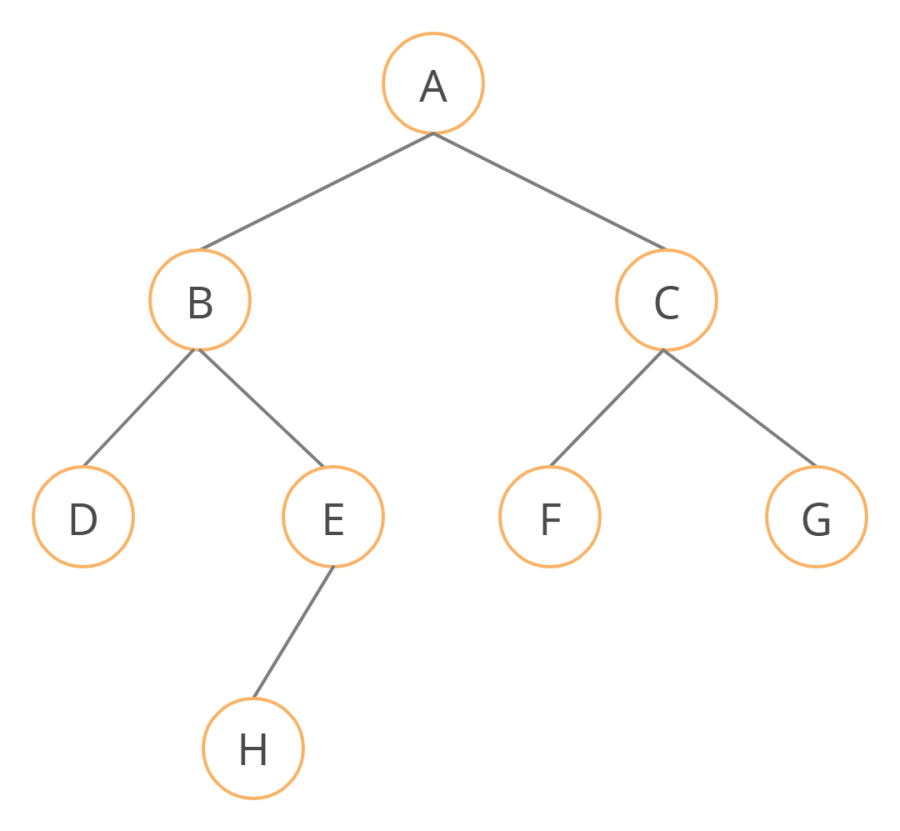
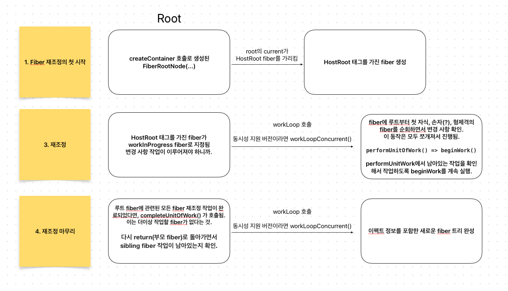
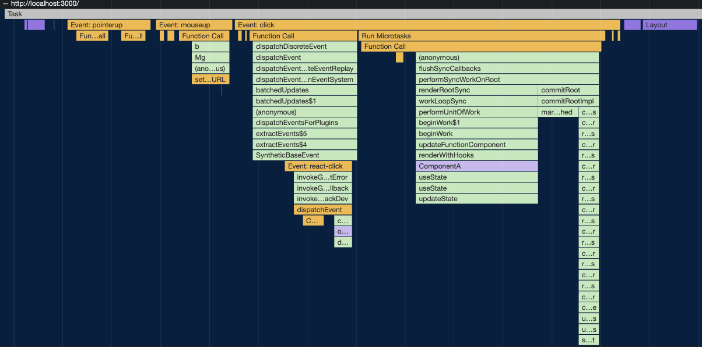

# Fiber

Fiber, 리엑트의 동시성 기능을 적용하고 기존 Stack 아키텍처로 구성된 재조정 엔진을 보완한 재조정 엔진이다. 리엑트 16 버전부터 적용되어 사용되고 있다.

## Stack Reconciler

LIFO 메커니즘으로 동작하는 스택 데이터 아키텍처를 기반으로 설계된 스택 리콘실러(Stack Reconciler)는 구조상 모든 작업을 동기적으로 하나씩 스택에 쌓인 작업 프레임을 처리할 수 있었다.

render() 를 통해 전달된 컴포넌트 혹은 네이티브 타입의 리엑트 엘리먼트 트리는 기존에 적용되어 있는 엘리먼트 트리와 재조정하는 과정을 거쳐 비교하게 되는데, 
엘리먼트 트리의 루트부터 children을 재귀적으로 순회하고 변경된 사항을 취합하고, 커밋하여 실제 DOM 노드에 변경이 필요한 부분을 커밋한다.

위와 같이 재조정 알고리즘은 재귀 알고리즘 방식으로 동작하는데, 피보나치 수열을 구하는 재귀 구조의 함수처럼 노드(리엑트에서는 비교해야할 자식 컴포넌트로 생각할 수 있다.)의 
갯수에 따라 매우 깊은 콜스택이 형성된다.

```js
function fib(n) {
  if (n < 2) {
    return n;
  }
  return fib(n - 1) + fib(n - 2)
}

fib(10)
```

```
| fib(1) |
| fib(2) |
| fib(3) |
|  ...   |
----------
```

하나의 부모 엘리먼트의 업데이트는 이하 children의 속하는 엘리먼트 트리를 재귀적으로 비교하기 때문에 마찬가지로 매우 큰 콜스택이 형성되고 다음과 같은 문제가 발생할 수 있다.

1. 부모 엘리먼트의 업데이트를 포함한 재귀적인 자식 엘리먼트들의 비교와 업데이트가 모두 즉시 반영될 필요가 없을 수 있으나, 변경 사항을 푸시하는 모든 작업을 동기적으로 하나의 큰 텍스크가 형성된다. (중단이 불가능)
2. 리엑트 특성상 잦은 리랜더링 메커니즘과 내부적인 라이프 사이클 호출로 재조정이 발생할 여지가 매우 높은데 이로 인해 깊은 콜스택이 형성되나 단일 스레드라는 점에서 부하가 걸릴 수 있다.
3. 덩치가 큰 작업 처리 과정에서 이후 스택에 쌓인 (사용자 입장에서 빠르게 반응하기 원하는) 작업들이 쌓여 많은 시간을 대기하게 되고, 사용자 관점에서 가장 자연스러운 60 프레임에 부합하기 어려워진다.

## Fiber Reconciler

스택 리콘실러에서 언급된 문제점들을 해결하고자 제작된 재조정 엔진이다. 동기에 걸맞게 다음과 같은 메커니즘을 수행할 수 있어야 한다.

1. 작업을 중단하고 나중에 다시 돌아올 수 있어야 한다. (우선 순위가 높은 작업이 대기 중이라면 작업을 중단, 실행권을 양보할 수 있어야 한다. )
2. 다른 종류의 작업에 우선순위를 부여할 수 있어야 한다.
3. 이전에 완료된 작업을 재사용할 수 있어야 한다. (이것도, alternate로 가지고 있는 fiber?)
4. 더 이상 필요 없어지면 작업을 중단할 수 있어야 한다. (아래서 언급하겠지만, 각각의 fiber 프레임이 alternate를 통해 진행 중인 작업 이전의
현재 적용된 fiber 정보를 가지고 있는 것. 만약 작업 중 덮어쓸만한 작업이 추가적으로 발생하면 현재 작업을 폐기하고, alternate로 가지고 있는
fiber로 다시 돌아가는 건가..?)

잠시 자바스크립트 엔진의 실행 스택과 이벤트큐의 구조와 동작을 간단하게 살펴보자.


1. 스택 구조로 호출된 함수의 실행 컨텍스트가 생성되고 실행 스택에 쌓인다. (가장 먼저 글로벌 실행 컨텍스트)
2. 비동기적인 (setTimeout, API call) 등의 동작들의 콜백은 이벤트 큐에 쌓인다.
3. 현재 실행 스택에 쌓인 작업이 없거나, 글로벌 실행 컨텍스트만 남아있는 경우! 이벤트 큐의 작업을 가져와 실행 스택으로 가져와 처리된다.

_이하는 레퍼런스를 참고한 개인적인 의견이 담겨 있어 올바르지 않은 설명일 수 있음._

1. 레퍼런스에서 자바스크립트 엔진을 언급한 것은 뭐지?, 콜스택에 쌓인 작업이 작고, 빠르게 처리된다면 이벤트큐에
쌓여 있는 작업을 빠르게 처리할 수 있다. 
리엑트에서 Fiber (가벼운 실행 스레드)는 마치 위와 같이 동작하며 이 메커니즘 자체를 지칭한다.
하나의 큰 작업 (노드부터 children를 재귀적으로 순회하고 비교) 을 잘개 쪼개고 이를 스택에 쌓는다.
이 각각의 프레임들은 fiber라고 칭하는 객체 구조로 생성된다.

(Fiber는 메커니즘 자체 혹은 각각의 쪼개진 작업의 단일 프레임을 지칭하고 있다. 레퍼런스들에서는 대소문자를
사용해서 구분짓고 있는데, 명확한 표현이 있는지 궁금. + 자바스크립트 엔진의 구조를 가져와 설명한 것은 리엑트
자체적으로 리엑트에 특화된 콜스택, 스택 프레임을 처리하는 메커니즘을 Fiber라는 이름으로 칭하고 구현한 것 같다.
쪼개진 작업을 처리하고, 스케쥴러에 쌓인 작업들 중 우선순위가 높은 작업이 있는지 일정 시간, 혹은 isInputPending과
같은 API를 통해 한번씩 확인하는 과정이 포함되어 있는 것이 비슷하다는 것 같음.) 

## Fiber 노드

우선, 큰 리소스가 필요한 작업이 하나의 콜스택 프레임으로 전달되어 이후 작업들의 대기 상태가 길어지는 문제점을 해결하기 위해 큰 작업을 여러 단계로 잘게 쪼개 각각의 작업 프레임으로 나눈다. 해당 각각의 작업은 **제어가 가능한 스택 프레임이며 이를 fiber 노드라 칭한다.**

가령, 부모 엘리먼트의 업데이트로 자식 노드를 재귀적으로 비교하고 변경 사항을 취합해야 하는 작업이 있다면, 스택 재조정 엔진의 경우 이 모든 작업을 하나의 큰 작업으로 형성하고 처리한다. (쉽게는 DFS 과정을 하나로)

파이버 재조정 엔진의 경우 각각의 비교 작업을 하나의 작은 fiber 프레임 작업으로 구성한다. (A → B → D → …) 다시 강조하면,
각각의 fiber 프레임들은 중단, 양보, 폐기, 재사용이 가능하다. 이것은 재귀적으로 큰 작업이 덩어리로 스택에 쌓여 제어가 불가능한 작업과는 구조적으로 다르다.



그렇다면, 잘게 쪼개진 작업을 어떻게 이어 진행, 중단, 양보, 폐기, 재사용이 가능하다는 건가. fiber 노드는 리엑트 내부에서 사용되는 Fiber 인터페이스를 가진 객체로 구성되어 있고, 이는 각각의 모든 작업과 대응된다.
모든 fiber는 컴포넌트 인스턴스에 대한 인풋과 아웃풋의 정보를 가지고 있다.

인터페이스는 [ReactInternalTypes.js](https://github.com/facebook/react/blob/main/packages/react-reconciler/src/ReactInternalTypes.js#L83)에서 확인할 수 있다.

```ts
type Fiber = {
  // 인스턴스 관련 항목
  tag: WorkTag,
  key: null | string,
  type: any,

  // 가상 스택 관련 항목
  return: Fiber | null,
  child: Fiber | null,
  sibling: Fiber | null,

  // 이펙트 관련 항목
  flags: Flags,
  nextEffect: Fiber | null,
  firstEffect: Fiber | null,
  lastEffect: Fiber | null,
  alternate: Fiber | null,
};
```

#### 1. fiber 인스턴스 관련 키

- `tag: WorkTag`, 해당 Fiber 노드가 대변하고 있는 컴포넌트 혹은 네이티브 요소의 인스턴스 유형을
표현한다. 0-25 정수값으로 이루어져있고, 각각의 숫자는 FunctionComponent, ClassComponent, HostRoot
등등을 표현하고 있는데, 자세한건 [ReactWorkTags.js](https://github.com/facebook/react/blob/main/packages/react-reconciler/src/ReactWorkTags.js)
에서 확인 가능하다.
- `key: null | string`, 해당 fiber가 가리키는 인스턴스의 고유한 식별자이다. 흔히 리스트형 컴포넌트에 부여하는 
고유한 키와 동일한 역할이다.
- `type: any`, 컴포넌트 혹은 네이티브 요소의 타입을 가지고 있다. `div`, `span`, `f ComponentA` 등등.
다만, 루트노드의 fiber는 null이다.

key, type은 재조정 과정에서 해당 fiber의 키로 구분하고, 해당 fiber 인스턴스를 유지할 지 새롭게 fiber를 생성할지
결정하는 역할을 한다. (재조정 디핑 과정에서 키, 타입을 통해 컴포넌트 인스턴스를 재사용할 건지 결정하는 것과 같음.)

#### 2. 해당 fiber와 연관된 fiber 관련 키

- `return: Fiber | null`, 해당 fiber의 부모격이 되는 fiber를 가리키고 있음. return값을 통해 현재 fiber의
끝나면 다시 부모 fiber 작업으로 돌아가기 위한 포인터 역할
- `child: Fiber | null`, 여러 자식들에 대한 fiber 중 첫 자식격이 되는 fiber를 가리키고 있음.
- `sibling: Fiber | null`, 현재 fiber의 형제격이 되는 fiber를 가리킨다. child가 없으면 sibling이 가리키는
노드로 탐색을 이어간다.

**부모에서 첫 자식으로 이동, 첫 자식에서 자식이 있으면 자식으로, 없으면 자기의 형제격되는 fiber 노드로 이동하며 탐색,
이렇게 되면 트리 구조에서 linked list로 탐색하는 게 가능해진다.**

#### 3. 이펙트 관련 키

변경점들에 대해 부수적으로 발생해야 하는 작업들 정보를 가지고 있다.

- `flags: Flags`, 이펙트, 변화 유형을 유니크한 정수값으로 가지고 있는데 이를 비트맵으로 표현된 값을 가지고 있다.
[ReactFiberFlags.js](https://github.com/facebook/react/blob/main/packages/react-reconciler/src/ReactFiberFlags.js)
- `nextEffect: Fiber | null`, `lastEffect: Fiber | null`, 해당 fiber 하위에 있는 서브트리에서
첫 이펙트를 가지고 있는 fiber와 마지막 이펙트를 가지고 있는 fiber를 가리킨다. 특정 fiber에서 이루어진 작업만
일부 재사용하기 위해 사용된다. (이건 좀..)
- `alternate: Fiber | null`, 해당 fiber의 교대 fiber. (이것도 좀..)

트리 비교 작업이 끝나면 변경된 사항이 render -> commit -> phase를 통해 화면에 적용되는데 이떄 적용된 화면을
대변하는 fiber를 `flushed fiber`, 이와 달리 화면에 적용하기 위해 열심히 작업 중인 상태의 fiber를 `workInProgress fiber`
라고 부른다. 결국 특정 컴포넌트는 두 가지 버전의 fiber를 가질 수 있고, `alternate`가 대응되는 fiber를 가지고 있는 셈
화면에 적용된 fiber는 work~ fiber를, 반대로는 flushed fiber를.

## Fiber 메커니즘 동작

Fiber의 재조정은 render, commit 두 단계로 구분된다. 

- render, 두 fiber 트리를 비교하고 변경된 이펙트들을 수집하는 작업, 동시적으로 진행되고 중단, 양보, 재시작이
가능한 단계이다. 스케쥴러에게 실행권을 위임받는 동안 동작하고 다시 메인스레드의 실행권을 양보하면서 더 급한 작업이
있는지 확인한다. 우선순위가 높은 작업이 있던 없던 작업 가능한 시간은 대략 5ms 정도.
**최종 목적은 이펙트 정보를 포함한 새로운 fiber 트리를 구축하는 것.**
- commit, 새로운 fiber에 담긴 이펙트들을 모아 실제 DOM에 반영하는 작업. 이 단계는 취소, 일시 정지가 불가능한
동기적인 작업 처리로 이루어짐.

실제 구현체 로직 순서는 대략 다음과 같은데, 요약하자면.



#### render

1. 상태 변경
2. alternate 트리의 루트 fiber를 workInProgress로 설정 후 beginWork 호출
3. 해당 변경사항에 적절한 effect 유형을 표시해줌.
4. 해당 fiber의 child fiber의 포인터를 따라 이동, child fiber를 workInProgress로 설정 후 다시 beginWork 호출
5. 위 과정을 반복하며 최하단 fiber까지 완료 후 completeWork 호출해서 표시된 변경 effect 유형들을 취합함.
6. 다시 return fiber로 돌아오는 과정에서 sibling이 있다면 sibling을 workInProgress로 설정 후 다시 beginWork 호출
7. 위 과정을 반복해서 결국 루트로 돌아와 completeWork!.

#### commit

1. workInProgress fiber 트리에 화면에 반영되어야 하는 모든 이펙트들이 담겨있음.
2. 해당 fiber 트리를 화면에 flush 해준다. 이 작업은 취소, 중단 불가
3. 완료 후 루트의 current 포인터가 방금 flush한 트리를 가리키고 기존의 current 트리를 새로운 workInProgress 트리로 지정.

버튼 클릭으로 카운트업하는 이벤트 트리거에 대해 실행되는 로직들을 대략적으로 보면 위에 언급된 함수 호출 확인 가능.



## Reference

- https://bumkeyy.gitbook.io/bumkeyy-code/frontend/a-deep-dive-into-react-fiber-internals
- https://blog.mathpresso.com/react-deep-dive-fiber-88860f6edbd0
- https://github.com/aidenybai/million-demo


