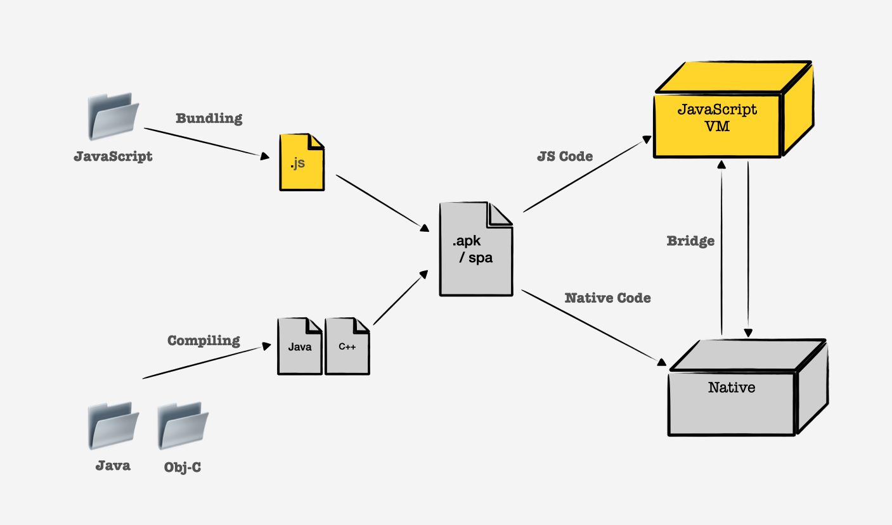
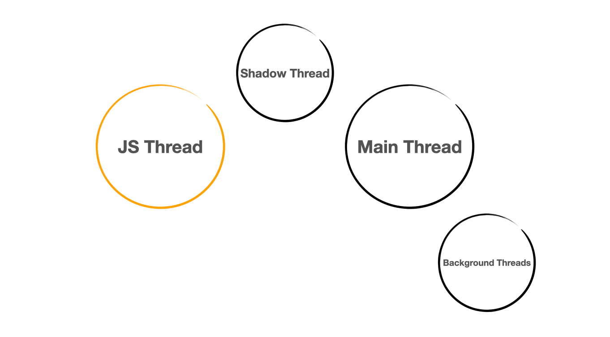
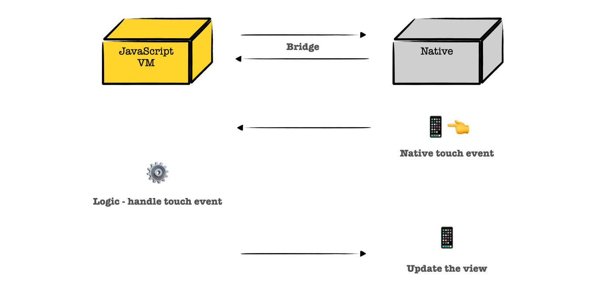

# 리엑트 네이티브의 개요와 동작 원리

_[React Native](https://reactnative.dev/)_ 는 리엑트와 자바스크립트로 작성된 뷰를 iOS, 안드로이드의 네이티브한 영역에서 랜더링할 수 있는 기능을
제공하는 라이브러리이다. 리엑트와 자바스크립트 생태계가 익숙하다면, 대표젹인 두 네이티브 앱을 시뮬레이팅하며 간단하게 개발할 수 있다.

## Process

리엑트 네이티브의 프로젝트는 자바스크립트 코드와 네이티브 코드 (_Java/Kotlin for Android, Objective-C/Swift of iOS_)로 이루어져있으며
두 코드 레벨이 함께 결합되어 동작한다. 여기서 네이티브 코드는 네이티브에서 직접적으로 실행되며, 자바스크립트 코드는 가상 머신(VM) 위에서 동작한다.

iOS의 경우 C++로 작성된 JavaScriptCore라고 불리는 빌트인 자바스크립트 엔진을 가지고 있어 자체적으로 자바스크립트 코드를 컴파일하고 실행할 수 있다.
반면, 안드로이드의 경우 내장된 자바스크립트 엔진이 없어 리엑트 네이티브로부터 자바스크립트 엔진을 함께 빌려 제공받는다.

**네이티브를 위한 언어 모델과 자바스크립트는 다른 프로그래밍 언어이기 때문에 서로 직접적으로 상호작용할 수 없다.** 리엑트 네이티브는 이러한 문제를
양쪽 언어가 모두 수용할 수 있는 형식(JSON)의 데이터를 통해 서로 상호작용할 수 있도록 하는데, **이 소통을 중개하는 역할이 바로 Bridge이다.**



### Build, Runtime

빌드 시, Java 혹은 Objective-C로 작성된 네이티브 코드는 Java와 C++ 바이너리 파일로 컴파일되고, JavaScript 코드는 [Metro](https://reactnative.dev/docs/metro)
를 통해 번들링된다. Metro는 Webpack 번들러와 유사하게 동작하지만, 리엑트 네이티브 환경에 최적화되어 있는 번들러이다. 이렇게 얻어진 바이너리 파일들과 자바스크립트 
번들은 최종적으로 대상 플랫폼에 적합한 파일로 압축된다.

런타임에서, JavaScript 코드는 JavaScript VM에서 실행되며, Native 코드는 해당 운영체제 장치에서 직접 실행된다. 이때, Bridge를 통해 두 영역의 소통을
위한 직렬화된 메세지를 전송하고, 전달받은 메세지는 역직렬화하여 가공한다.

## Threads

유저가 앱을 실행하면, 장치에서는 세개의 메인 스레드가 실행되고 필요한 경우 추가적인 백그라운드 스레드가 실행된다.



1. **Main Thread**, 메인 스레드는 앱이 실행되는 네이티브의 기본적인 스레드이다. 유저 인터렉션이나, 장치 스크린에 UI를 랜더링하는 주요한 작업을 담당한다.
메인 스레드는 빌드된 모든 앱에서 실행되는 동일한 스레드이다.
2. **JavaScript Thread**, 자바스크립트 스레드는 자바스크립트 혹은 리엑트 코드로 작성된 앱의 비즈니스 로직을 실행한다.
3. **Shadow Thread**, 쉐도우 스레드는 자바스크립트 스레드에 의존적으로 실행된다. 뷰의 위치를 계산하고, 자바스크립트 스레드에서 코딩된 레이아웃 트리를 구성한다.
리엑트 네이티브는 Yoga라고 불리는 레이아웃 엔진을 사용하는데, 레이아웃 시스템안에서 flexbox 기반으로 작성된 레이아웃을 네이티브가 이해할 수 있는 레이아웃 시스템
으로 변환한다.
4. **Native Modules Thread**, 네이티브 모듈 스레드는 앱에서 네이티브 플랫폼에서 제공하는 API에 접근해야 하는 경우 이를 처리하기 위한 스레드이다.

## Bridge

브릿지는 리엑트 네이티브 아키텍처에서 가장 중요한 요소이다. 니는 JSON 형식의 데이터를 통해 자바스크립트와 네이티브 레이어에서 서로 정보를 교환할 수 있도록 한다.
웹에서 프론트와 백엔드 레이어 간 서로의 상태와 정보, 혹은 어떤 언어로 작성되어 있는지와는 상관없이 원하는 정보만을 요청, 응답하는 것과 같이 브릿지는 자바스크립트
와 네이티브 레이어 간 데이터를 상호 교환할 수 있도록 한다.



1. 네이티브 디바이스에서 터치 이벤트가 발생한다. 
2. 네이티브 영역에서 브릿지를 통해 해당 정보를 담은 직렬화된 메세지를 자바스크립트 영역으로 전달한다.
3. 자바스크립트 영역에서 직렬화된 메세지를 역직렬화하여 해당 정보를 전달받아 취해야 할 다음 액션을 결정한다.
4. 자바스크립트 영역에서 결정된 다음 액션을 마찬가지로 직렬화된 메세지를 통해 네이티브 영역으로 전달한다.
5. 네이티브 영역에서 직렬화된 메세지를 역직렬화하여 뷰를 업데이트한다.

## Problem with the Bridge

브릿지는 비동기적으로 동작하는데, 이는 엣지 케이스를 발생시킬 여지가 다분하다. 브릿지의 비동기식 데이터 교환은 매우 빠르게 동작하지만, 어쩌면 동기적으로 데이터를
교환하는 것이 더 나은 방식일 수 있다.

가령 입력창에 유저의 카드 정보를 입력받는다고 생각해보자. 네 자리 수마다 공간을 두어 카드 번호를 입력하기 편하도록 구현한다.

```js
const handleCardNumberInputChange = (cardNumber) => {
  const formatted = cardNumber.toString().replace(/\d{4}(?=.)/g, '$& ');
}
```

여기서 문제는, 사용자가 입력한 문자에 대한 네이티브 레이어의 정보는 이미 방금 입력한 문자가 입력창에 랜더링된 후 전달된다.
랜더링 이후 전달된 정보를 통해 빈 공간을 추가해야 할 지를 자바스크립트 레이어에서 판단하여 전달하는데, 이는 리랜더링을 발생시킨다.
즉, ("12345" 로 랜더링이 이루어진 후 "1234 5"로 리랜더링될 수 있다.)

해당 정보에 대한 처리가 브릿지에서 유일하게 이루어지고 있다면, 매우 빠르게 처리되어 위와 같은 문제를 만나기 쉽지 않지만, 무겁고
큰 작업 처리를 요하는 이벤트가 반복적인 발생이 된다면 충분히 만날 수 있는 비동기적 이슈이다.

또 다른 근본적인 문제는 자바스크립트 그리고 네이티브 레이어에서 정보를 교환하기 위해 직렬화, 역직렬화를 지속적으로 진행해야 한다는 점이다.
이는 앱 크기에 따라 처리 장치에 부하를 주기 충분하다. 이러한 문제는 리엑트 네이티브팀에서 인지하고 있었고, 더 나은 아키텍처를 구상하여
새롭게 도입되었다.

## JSI, JavaScript Interface

리엑트 네이티브 0.68 버전을 시작으로 등장한 아키텍처인 JSI는 브릿지 메커니즘을 대체한다. JSI는 모든 자바스크립트 엔진에서 사용할 수 있는 
범용적이고 경량화된 레이어이며, 이를 통해 네이티브 레이어의 API를 직접 접근, 사용할 수 있게 되었다.

C++은 HostObject를 통해 네이티브 Java/Objective-C 메서드와 객체를 자바스크립트에 노출시키며, 자바스크립트는 이 객체를 참조하고 Java/Objective-C
API를 직접 엑세스할 수 있도록 한다. 이는 동일한 스레드에서 동기적으로 수행하거나, 새 스레드를 생성하여 비동기적으로 수행할 수 있다.

## Reference
- https://medium.com/front-end-weekly/how-does-react-native-work-understanding-the-architecture-d9d714e402e0
- https://reactnative.dev/docs/the-new-architecture/landing-page
