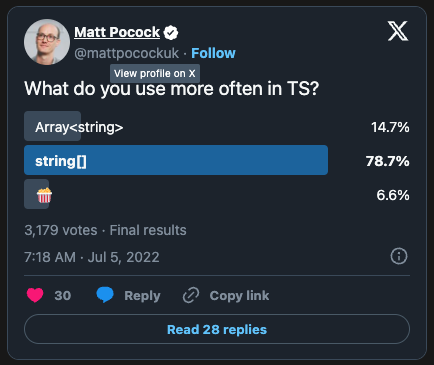

## string[] 보단, Array\<string>을 사용하세요.

[@Tanstack/query](https://github.com/TanStack/query)의 메인테이너인 [tkDodo](https://tkdodo.eu/blog/)가 위와 같은 결과에 대해
의견을 적은 글이 있어 정리해본다. 



[X 투표](https://twitter.com/mattpocockuk/status/1544083145833717767)

기능적 차이는 크게 없지만, 투표 결과는 투표 결과는 `string[]`을 주로 사용하는 경우가 압도적으로 많았다. 개인적으로도 `string[]`을 익숙하게 사용하는데
저자는 당혹(?)스러워 하면서 `Array<string>`가 낫다는 의견과 함께 그 이유에 대해 나열한다.

먼저 그럼 왜 `string[]`을 많이 사용하는지가 궁금하다. 단지 타이핑이 비교적 짧아서 일 수도 있겠다. 하지만 코드상에서 같은 의미와 기능을 하는 짧은 것이
좋은 것이라면 `dashboard` 보다는 `d`, `index` 보다는 `i`가 낫겠다.

### 가독성

보통 왼쪽에서 오른쪽으로 이동하며 읽기 떄문에 중요한 내용이 더 먼저 나와야 한다. `Array<string>`, `string[]`은 배열 타입을 표현하는 내용을 담는다는 점에서
배열에 의미를 담은 내용이 먼저 나오는 것이 옳다.

```ts
const items: Array<string> = [];

const items: string[] = [];
```

더불어 다음과 같이 `options`의 타입을 명시할 때 타입의 내용이 길어질 수 있다. 배열 타입 표기가 뒤에 있어 간혹 `options`에 대한 객체 선언으로 오해할 수 있다.

```ts
const options: {
  a: '1',
  b: 3,
  c: 'd',
  e: null,
  ...
  [key: string]: unknown
}[]

const options: Array<{
  a: '1',
  b: 3,
  c: 'd',
  e: null,
  ...
  [key: string]: unknown
}>
```
 
### 읽기 전용 배열

함수에 대한 입력으로 사용되는 대부분의 배열은 우발적인 변경을 방지하기 위해 읽기 전용으로 인자로 전달하는 경우가 많다. 배열을 읽기 전용으로 표현하기 위한 두 가지
방법이 있다. `ReadonlyArray`라는 제너릭을 제공하고 있어 `readonly` 예약어를 사용하지 않고 표현이 가능한데, 굳이 읽기 전용이라는 표현과 배열 타입 표현을
구분지어 표현할 필요가 있는가?

```ts
function add(items: ReadonlyArray<string>, newItem: string)

function add(items: readonly string[], newItem: string)
```

### 유니온 타입

배열의 요소 타입을 숫자나 문자열로 설정할 수 있도록 표현하려면 유니온 타입을 사용할 수 있다. `...[]` 형태의 배열 타입 표현을 사용하면, 유니온 타입을 `()`
로 묶어주어야 한다.

```ts
const items: Array<string | number> = [];

const items: string | number[] = []; // X
const items: (string | number)[] = []; // O
```

### keyof

객체와 객체의 가능한 키 배열을 함께 전달받는 함수가 있다. 그리고, 전달 받은 키값만을 가지는 객체를 취하거나, 삭제할 수 있다고 생각해보자.

```ts
const myObject = {
  foo: true,
  bar: 1,
  baz: 'hello world',
}

pick(myObject, ['foo', 'bar'])
```

가능한 키 배열은 객체의 키값만을 포함하는 배열인데, 이를 위해 keyof 연산자를 사용할 수 있다.

```ts
function pick<TObject extends Record<string, unknown>>(
  object: TObject,
  keys: Array<keyof TObject>
) {
  ...
}
```

다음은 제너릭을 사용하지 않은 배열 타입 표현을 사용해보면 다음과 같은 에러를 발생시킨다.

```ts
function pick<TObject extends Record<string, unknown>>(
  object: TObject,
  keys: keyof TObject[]
) {
  ...
}

pick(myObject, ['foo', 'bar'])
// Argument of type 'string[]' is not assignable to parameter of type 'keyof TObject[]'.(2345)
```

이또한 올바르게 구현하려면 다음과 같이 `()`로 묶어주어야 한다.

```ts
function pick<TObject extends Record<string, unknown>>(
  object: TObject,
  keys: (keyof TObject)[]
) {
  ...
}

pick(myObject, ['foo', 'bar']) // OK
```

### Reference

- https://tkdodo.eu/blog/array-types-in-type-script
- https://twitter.com/mattpocockuk/status/1544083145833717767


