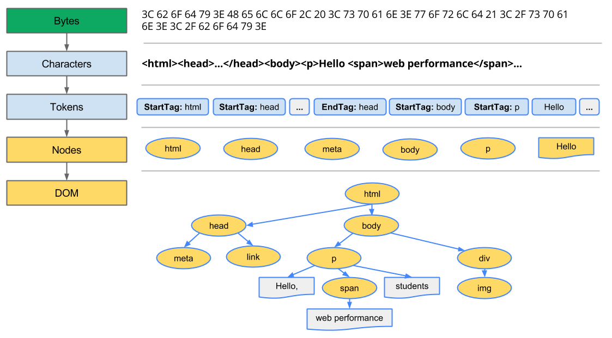
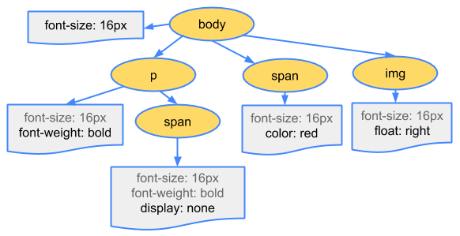
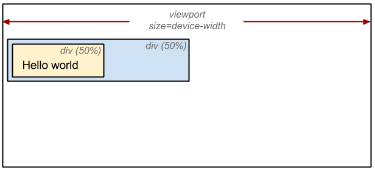

## 브라우저 랜더링 과정

브라우저의 핵심 동작은 HTML, CSS, JS를 통해 사용자가 인터렉션할 수 있는 페이지를 구축하는 일이다.
메인, 워커, 컴포지터, 레스터 스레드를 가지고 있다.

1. DOM 트리 구축
2. CSSOM 트리 구축
3. 자바스크립트 실행
4. 랜더트리 구축
5. 레이아웃 생성 (랜더트리 배치)
6. 페인팅 (랜더트리 그리기)

### 1. DOM 트리 구축

랜더링 엔진에서 아래 작업을 진행된다.

1) 브라우저는 전달받은 HTML파일을 파싱하기 시작한다. 
2) HTML에 정의된 인코딩 규칙(e.g. UTF-8)에 따라 개별 문자로 변환한다.
3) 변환된 문자열을 HTML5 표준에 지정된 고유 토큰으로 반환하는 토큰화 과정을 거친다.
4) 해당 토큰들에 대한 속성과 규칙을 정의하는 객체로 반환한다.
5) HTML 마크업 파일에 정의된 여러 태그간의 관계(자식, 형제)를 해석하여 트리 구조로 연결한다.

### 2. 리소스 요청

랜더링 엔진에 의해 HTML 파일이 분석되는 과정에 img, link, script와 같은 태그를 만나면
부가적인 리소스를 요청하거나 캐시로부터 가져오기 위해 네트워크 스레드에 해당 작업을 요청한다.

### 3. CSSOM 트리 구축

1) inline style + 외부의 요청으로 전달받은 css 파일을 파싱한다.
2) 파싱하는 과정은 HTML 파싱 과정과 동일하다.
2) 대응되는 DOM 노드에 대한 계산된 스타일을 결정한다.

### 4. 랜더트리 구축

1) DOM, CSSOM 트리를 결합해서 랜더링 트리를 생성한다.
2) 랜더트리는 페이지에 표시되는 모든 DOM 컨텐츠와 각 노드에 대한 모든 CSSOM 스타일 정보를 캡쳐한다.
  - 표시되지 않는 메타태그와 같은 노드들은 생략된다. + css를 통해 display:none되어 스타일상 레이아웃이
  구성되어 있지 않는 노드 또한 생략. + 가상선택

### 5. 레이아웃 생성 (랜더트리 배치)

랜더트리를 바탕으로, 각각의 요소들이 위치해야 하는 기하학적인 구조를 배치하는 과정이다.
뷰포트 내 정확한 위치를 계산해 절대적인 픽셀로 변환된다.

### 6. 페인팅 (랜더트리 그리기)

랜더링 트리와 레이아웃 단계에 거친 연산을 바탕으로 랜더링 트리를 화면에 픽셀로 변환하는 과정을 거친다.
이미 레이아웃 단계에서 각 노드들의 위치, 크기, 색상 등 스타일이 모두 계산되어 있기 때문에
화면에 실제 픽셀로 변환하는 과정을 진행한다.

