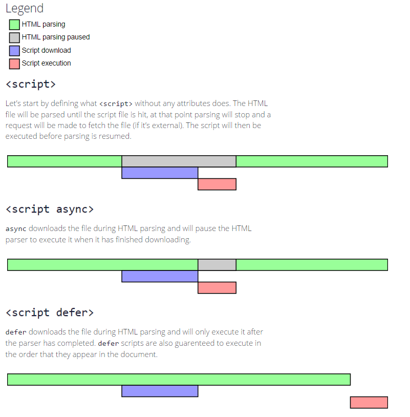

## 브라우저 랜더링 최적화

브라우저 랜더링 최적화는 웹 페이지의 사용자 경험을 향상시키는데 목적을 둔다. 브라우저 랜더링 과정에 걸리는 시간을
최소화하는 것인데, 브라우저 랜더링 과정을 다시 한번 살펴보자.

1. HTML 파일을 전달받아 DOM 트리를 구축한다.
2. CSS 파일을 파싱하여 CSSOM 트리를 구축한다.
3. DOM 트리와 CSSOM 트리를 합성하여 랜더트리를 구축한다.
4. 랜더트리를 기반으로 각각의 트리 노드의 위치와 크기를 계산하고 레이아웃을 구성한다.
5. 계산된 기하학적인 값들과 스타일을 통해 개별 노드를 화면에 그린다.

## 1. 랜더링 차단 리소스

### CSS 파일 로딩 최적화

브라우저가 랜더링하는 과정 중 차단을 발생시키는 리소스들이 있다. 

1. HTML, HTML 파일을 받아 해당 파일을 DOM 트리로 구축해야 한다.
2. CSS, HTML을 파싱하여 DOM 트리를 구성하는 과정은 태그를 발견할 때마다 순차적으로 구축이 가능하다.
하지만, CSSOM 트리를 구축하는 경우, CSS 파일을 모두 해석해야만 CSSOM 트리를 구축할 수 있다. 
브라우저는 DOM, CSSOM 트리를 완전하게 사용할 수 있기 전까지 랜더트리를 구성하지 않기 때문에 해당 자원들로 인해
블록이 발생하는 시간을 최소화해야 한다.

_즉, 최초 랜더링 과정을 최적화하려면, CSS 파일은 최대한 빠르게 다운로드되어야 하기 때문에 CSS 파일을 불러오기 위한
`link` 태그는 항상 HTML 문서 최상단 `head` 아래 위치하는 것이 좋다._

혹은 압축된 CSS 파일을 전달받거나, 링크된 CSS 파일을 전달받기 위한 조건을 걸어 불필요한 CSS 파일 다운로드를 막을 수 있다.

```html
<link href="style.css" rel="stylesheet">
<link href="print.css" rel="stylesheet" media="print">
<link href="other.css" rel="stylesheet" media="(min-width: 40em)">
```

### FOUC (Flash Of UnStyled Content)

FOUC는 외부의 CSS를 불러오기 전에 스타일이 적용되지 않은 페이지가 잠시 나타나는 현상이다. 특히 IE에서 자주 발생.
브라우저가 마크업에 참조된 파일들을 모아 DOM을 생성할때 가장 빠르게 분석할 수 있는 부분을 먼저 화면에 표시한뒤,
화면에 출력된 마크업 순서에 따라 스타일을 적용하고 스트립트를 실행하기 때문이다.

FOUC를 해결하기 위해서는 head 태그 최상단에서 CSS 파일을 링크하고, `@import` 문을 최소화해야 한다.

### 자바스크립트 파일 실행 최적화

HTML을 파싱하는 과정에 `script` 태그를 만나게 되면 HTML 파싱 과정을 멈추고 JS 코드를 로드하여 파싱한 후 
실행한다. 스크립트에서 DOM 구조에 접근하는 방법으로 DOM 트리를 조작하고 구성을 변경시킬 수 있기 때문.

_`script` 태그를 HTML 가장 밑에 위치시키는 것이 좋다. async, defer와 같은 옵션을 통해 자바스크립트 코드를 
비동기적으로 로드하고 실행해서 랜더링 차단을 방지할 수 있다._

1. script, script 태그를 만나면 즉시 HTML 파싱을 중단하고, 스크립트 파일을 다운로드하고 실행한다.
2. script async, script 태그를 만나면 HTML 파싱을 이어가면서, 스크립트 파일을 다운로드한다. 
스크립트 파일 다운로드가 완료되면, HTML 파싱을 중단하고 스크립트를 실행한다.
3. script defer, script 태그를 만나면 HTML 파싱을 이어가면서, 스크립트 파일을 다운로드한다.
이후 HTML 파싱이 완료되면 스크립트 파일을 실행한다.



## Reflow, Repaint

최초 랜더링 이후 스크립트로 인해 발생하는 DOM과 스타일의 수정은 리플로우와 리페인트를 발생시킨다.
랜더링 단계의 layout, paint가 다시 발생하는 것을 각각 reflow, repaint라고 한다.


### Repaint

레이아웃에 영향을 끼치지 않은 단순 요소의 시각적인 스타일이 수정되었을때 발생한다. 레이아웃은 유지한채 
패인팅만 다시.

- color, box shadow, background, border-radius, ...

### Reflow

위치나 공간에 영향을 끼치는 스타일 속성이 수정되었을때 레이아웃 계산부터 다시 페인팅을 진행한다.

- DOM 노드의 추가, 제거, 위치 변경, 크기 변경 (margin, padding, border, width, height 등)
- CSS 에니메이션, 트렌지션 추가, 제거, 수정
- 이미지 크기 수정
- 폰트 및 텍스트 내용 수정
- offset, scrollTop, scrollLeft와 같이 계산된 스타일 정보 요청
- 윈도우 리사이징, 인라인 스타일 수정
- position, width, height, left, top, right, border, display, float, font-size, weight ...

리플로우가 발생하면 리페인트 또한 발생하기 때문에 리플로우를 발생시키는 케이스를 최소화해야 한다.

추가적으로, 
1. `display:none` 속성을 가진 요소는 랜더트리에 영향을 가하지 않으므로, 리폴로우, 리페인트를 발생시키지 않는다.
2. `position: fixed` 속성을 가진 요소는 컨텐츠 맥락 상 제외되기 떄문에 레이아웃에 영향을 주지 않는다.

### Reflow 최적화

1. 리플로우를 발생시키는 스타일 변경이 필요한 경우 최하위 노드의 스타일을 수정하는 것을 우선적으로 고려한다.
2. 인라인 스타일 사용을 최소화해야 한다. 인라인 스타일은 HTML 파싱 과정에서 레이아웃에 영향을 끼친다. 
3. 애니메이션이 있는 노드는 position: fixed, absolute로 지정한다. 해당 노드의 맥락을 구분하여 리플로우의
작업 크기를 제한할 수 있다.
4. 숨겨진 노드의 등장 과정이라면, 변경 사항을 모두 적용한 후 노출시키는 것이 좋다.


## Reference

- [Script Tag - async & defer](https://stackoverflow.com/questions/10808109/script-tag-async-defer)
