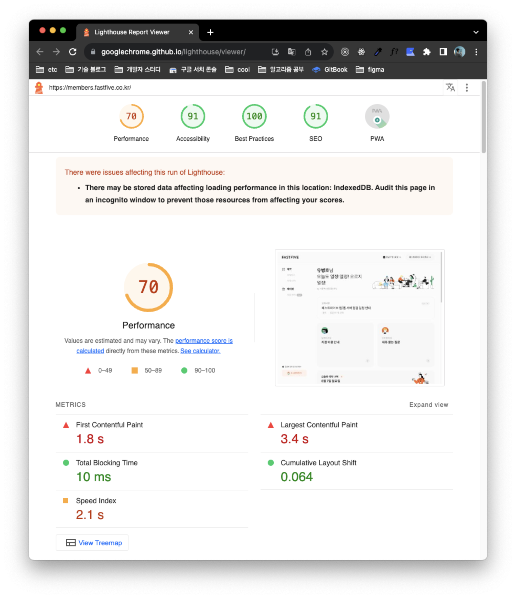

## Web Vitals

사용자 경험에 영향을 끼치는 웹 성능 지표를 정량적으로 측정할 수 있다. 우수한 사용자 경험을
제공하는데 필수적인 품질 신호를 지표를 통해 판단하고 개선해야 한다.

### Core Web Vitals

사용자 경험 기반 웹 브라우저의 성능 지표 중 손꼽히는 필수 지표 세가지를 Core Web Vitals이라
한다.

#### 1. Largest Contentful Paint (최대 컨텐츠풀 페인트, LCP)

LCP는 페이지가 처음 로드를 시작한 시점을 기준으로 뷰포트 내에 있는 가장 큰 이미지 혹은 텍스트 (메인 컨텐츠)
의 랜더링 시간을 나타낸다. 2.5초 이하로 제공되어야 한다.
``, `<svg>`, `<video>`, `url() 함수를 통해 로드된 배경 이미지 요소`, 텍스트 노드 또한 인라인 텍스트 하위 요소를 
포함하는 요소를 대상으로 선정한다.

LCP를 지연시키는 요소들은 다음과 같다.

1. 느린 서버 응답 시간, TTFB (Time to first Byte, 최초 바이트까지의 시간) 측정을 통해 서버 응답 시간을
측정할 수 있다. CDN 사용, HTML 캐시 우선 제공 등등의 방법으로 최적화할 수 있다.
2. 랜더링 차단 리소스 (javascript, css 등), 랜더링을 차단하는 리소스들에 대해 사이즈를 줄이거나, 지연 가능한
리소스에 대해 요청을 미루도록 처리한다.
3. 느린 리소스 로드 시간, LCP의 대상은 주로 이미지와 같이 사이즈가 큰 자원이다. 해당 이미지를 압축하여 전달받거나
최신 형식(webp)와 같은 이미지 확장자를 사용하고, 뷰포트 대비 이미지 사이즈를 조절하여 전달받는다.
4. 클라이언트 측 랜더링

#### 2. First Input Delay (최초 입력 지연, FID)

FID는 사용자가 페이지와 처음으로 상호작용(링크 클릭, 버튼 클릭, 인터렉션에 대한 스크립트 처리)할때 부터 
브라우저가 실제 이벤트 핸들러를 처리하기 시작한 시간까지를 측정한다. FID는 100ms 이하여야 좋은 지표이다.

FID를 지연시키는 주된 요인은 과도한 자바스크립트의 실행이다. 자바스크립트가 웹 페이지에서 구문을 분석하고,
컴파일, 실행하는 동안 (메인 스레드가 사용 중인 경우) 브라우저는 대부분의 사용자 인터렉션을 처리할 수 없다. 

긴 자바스크립트 작업을 세분화하여 실행하거나 외부로 부터 전달받는 스크립트를 최소화하는 것이 좋다.

#### 3. Cumulative Layout Shift (누적 레이아웃 시프트, CLS)

CLS는 시각적 안정성을 측정하여 지표화된 값이다. 페이지의 구조가 갑자기 변경되거나, 아무런 경고없이 텍스트가
움직이게 되고, 심한 경우 링크의 레이아웃 위치가 밀려 링크를 클릭하게 되는 경우를 만나게 된다.

1. 이미지 및 비디오 요소에 대해 크기 속성을 포함시켜 이미지 자원이 로드되기 전에도 레이아웃에 적절한 사이즈의
영역을 미리 소유하고 있도록 한다.
2. 사용자 상호 작용에 대한 응답을 제외하고, 기존 컨텐츠 위에 컨텐츠를 삽입하지 말아야 한다.
3. 레이아웃을 변경하는 속성의 애니메이션보다 트렌지션 애니메이션을 사용해야 한다.

### 부가적인 Metric

#### 1. TTI (Time To Interactive)

페이지가 로드되기 시작한 시점부터, 주요 하위 리소스 로드 이후 사용자 입력에 대해 안정적으로 응답이 가능하기까지
걸리는 시간을 측정하며, 3.8초 이내를 지향한다.

1. 조용한 기간(네트워크 요청, 자원 다운로드 등과 같은 무거운 작업이 없는 기간, 네트워크 GET 요청이 2개 미만인 기간)을 검샌한다.
2. 이후 긴 작업이 검색되지 않는다면, 마지막으로 발생한 긴 작업이 완료된 시간부터 FCP 시작 시점까지를 역추적하여 측정한다.

#### 2. FCP (First Contentful Paint)

페이지가 로드되기 시작한 시점부터 페이지 컨텐츠의 일부가 화면에 랜더링될 때까지의 시간을 측정한다.
여기서 컨텐츠란, 텍스트, 이미지 및 배경 이미지를 뜻하며 1.8초 이하를 지향한다.

위 이미지처럼, FCP는 첫 번째 텍스트와 이미지 요소의 랜더링 시작 시점을 뜻한다. 이는 LCP와 차이가 있다.

#### 3. TBT (Total Blocking Time)

메인 스레드가 입력에 대한 응답 처리를 막을 만큼 오래 차단되었을 때 FCP와 TTI 사이의 총 시간을 측정한다.
브라우저가 50ms 이상 소요되는 긴 작업을 처리하는 경우 메인 스레드가 차단된 것으로 간주한다. 따라서 사용자가 긴 작업 중
페이지와 상호 작용한 경우 브라우저는 처리 중인 작업에 대해 응답할 수 없기 때문에 처리 중인 작업이 완료될때까지 지연 및 차단된다.

위 타임라인에는 5개의 작업이 있는데, 그 중 3개가 50ms를 초과하여 지속되기 때문에 긴 작업으로 간주된다.

따라서 메인 스레드의 작업 처리로 인한 차단 시간은 총 345ms이다. (긴 작업 처리에 소요된 시간 - 50ms * 긴 작업 갯수)

#### 4. SI (Speed Index)

페이지의 눈에 볼 수 있는 컨텐츠가 얼마나 빠르게 채워지는 지 측정한다. 뷰포트의 크기에 따라 달라지는 수치이며 빠르면 빠를 수록 좋다.

### 측정 방법

구글에서 제공하는 크롬 익스텐션 [Lighthouse](https://chrome.google.com/webstore/detail/lighthouse/blipmdconlkpinefehnmjammfjpmpbjk?hl=ko)를 통해 측정할 수 있다.
메트릭스에 대한 점수와 해당 지표들에 대한 감점 원인들과 해결 방안 또한 제시해준다.

